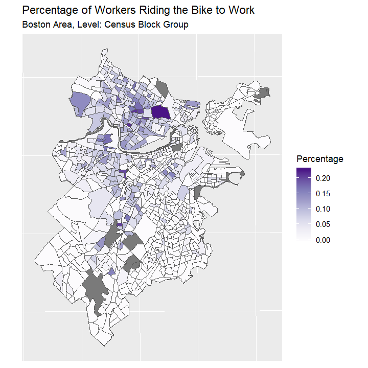

```{r setup, include = FALSE}
knitr::opts_chunk$set(
  collapse = TRUE,
  fig.align = "center",
  comment = "#>"
)
library(knitr)
options(width = 100)
```

# Introduction - PJ

Bike-sharing  system  refers  to  a  public  transportation service system in urban areas offering bikes for shared use to individuals in a relatively short period of time (about 30 − 45 minutes)  for  free  or  with  very  low  charges. Through bike sharing system, people can borrow bikes from nearby stations and return bikes to any stations in the city, which can be used as a alternative to private vehicles and regular public transportation, like buses and subways. As a green way to get around, bike sharing system can relieve the traffic jam in big cities, reduce the emission of harmful gases from motor vehicles, and improve the first mile and last mile connection to other kinds of transits. Therefore, bike sharing system has received more and more attention in recent years. In 2004, there are about 13 bike sharing systems around the world. But now, there are over 850 bike sharing systems globally. More and more big cities have established bike sharing systems, like Chicago (Divvy Bike), San Francisco (Bay Area Bike Share), New York (Citi Bike) and Boston (Bluebikes).

Boston’s original bike sharing system, Hubway, was launched in Boston on July 28, 2011 with 61 stations and 600 bicycles. In 2018, the municipal owners announced a six-year marketing deal with Blue Cross Blue Shield of Massachusetts and relaunch under the name of Bluebikes. From 2011 to 2018, more stations and more bikes were added. Now, Bluebikes has more than 2,500 bikes and over 260 stations across Boston, Brookline, Cambridge and Somerville.

This project aims to explore the usage patterns of Boston’s bike sharing system, Bluebikes, thus help decision makers to manage the bike sharing system more properly, and promote the full use of Bluebikes. The primary objectives includes:

1. Explore the usage of Bluebikess from 2015 to 2018. Visualize how the number of use and trip durations change among different months. Find out which months are people more like to use bike sharing system.
2. Use Linear Regression to figure out if there are any relationships between the number of use and the weather (including temperature and precipitation). Find out what kind of weather are people more like to use bike sharing system.
3. Use hot spot analysis (Getis-Ord Gi) to find out which census blocks are most popular for using bike sharing system, which census blocks are most popular as destinations for using bike sharing system, which census blocks are most popular as origins for using bike sharing system, and how they changed from 2015 to 2018. Analyze the demographic characteristics in areas of hot/cold spot clusters.
4. Use Poisson mixture model to process stations trip count data, extract station clusters based on EM algorithm, and analyze the clusters with census data to find out latent factors contributing to the use of bike sharing system.


# Methods
## Bluebikes’ Trips Exploration - PJ

At this section, we want to explore the usage of Bluebikess from 2015 to 2018 and visualize how the number of use and trip durations change among different months.

Bluebikes’ trips data are downloaded from Bluebikes’ website: https://www.bluebikes.com/system-data.
The data includes following information: trip duration (seconds), start time and date, stop time and date, start station name, start station latitude and longitude, end station name, end station latitude and longitude, bike ID, user type (casual or member), birth year, gender, year and month. The downloaded data is in cvs format, and each month has one cvs file. An example of how the raw data looks like is attached below, the data is from January, 2015. Each row is one trip.

{width=100%}

Analyses is performed on the data from January 2015 to December 2018 in order to generate a comprehensive understanding of the sharing system. We used packages `tidyverse`, `dplyr` and `tidyr` to analysis Bluebikess trips data from 2015 to 2018 and used packages `ggplot2` and `gridExtra` to visualize the data.

The libraries we used include:
```{r, eval = FALSE}
library(dplyr)
library(tidyr)
library(tidyverse)
library(ggplot2)
library(gridExtra)
```

The code to read and format the trips data is attached below. We use `rbind` function to combine monthly data into yearly data. And use `group_by` and `summarize` functions to calculate the number of records by month, mean durations by month and median durations by month. 
```{r, eval = FALSE}
#Read and format bike trip data in 2015
fileName2015 <- list.files(path = "D:/Class/R/FinalProject/Data/2015", full.names = TRUE)
bike2015 <- lapply(fileName2015, read_csv)
bike2015All <- do.call(rbind, bike2015)
bikeByMonth2015 <- bike2015All %>% group_by(month) %>% 
  summarize(records = n(), mean_duration = mean(tripduration),
            median_duration = median(tripduration), year = mean(year))

#Read and format bike trip data in 2016
fileName2016 <- list.files(path = "D:/Class/R/FinalProject/Data/2016", full.names = TRUE)
bike2016 <- lapply(fileName2016, read_csv)
bike2016All <- do.call(rbind, bike2016)
bikeByMonth2016 <- bike2016All %>% group_by(month) %>% 
  summarize(records = n(), mean_duration = mean(tripduration),
            median_duration = median(tripduration), year = mean(year))

#Read and format bike trip data in 2017
fileName2017 <- list.files(path = "D:/Class/R/FinalProject/Data/2017", full.names = TRUE)
bike2017 <- lapply(fileName2017, read_csv)
bike2017All <- do.call(rbind, bike2017)
bikeByMonth2017 <- bike2017All %>% group_by(month) %>% 
  summarize(records = n(), mean_duration = mean(tripduration), 
            median_duration = median(tripduration), year = mean(year))

#Read and format bike trip data in 2018
fileName2018 <- list.files(path = "D:/Class/R/FinalProject/Data/2018", full.names = TRUE)
bike2018 <- lapply(fileName2018, read_csv)
bike2018All <- do.call(rbind, bike2018)
bikeByMonth2018 <- bike2018All %>% group_by(month) %>% 
  summarize(records = n(), mean_duration = mean(tripduration),
            median_duration = median(tripduration), year = mean(year))
```

The code to plot the number of records per month from 2015 - 2018 is attached below. We use `ggplot` to create each year's figure first, and then use `grid.arrange` to format as a 2 by 2 figure.
```{r, eval = FALSE}
# Plot the number of use per month from 2015 - 2018
b1 <- bikeByMonth2015 %>% ggplot(., aes(x = factor(month), y = records)) +
  geom_bar(stat = "identity") +
  ylim(0, 250000) +
  ylab("The number of trips") +
  xlab("Month") +
  ggtitle("The number of trips by month in 2015")

b2 <- bikeByMonth2016 %>% ggplot(., aes(x = month, y = records)) +
  geom_bar(stat = "identity") +
  ylim(0, 250000) +
  scale_x_continuous(breaks=c(1:12)) +
  ylab("") +
  xlab("Month") +
  ggtitle("The number of trips by month in 2016")

b3 <- bikeByMonth2017 %>% ggplot(., aes(x = month, y = records)) +
  geom_bar(stat = "identity") +
  ylim(0, 250000) +
  scale_x_continuous(breaks=c(1:12)) +
  ylab("The number of trips") +
  xlab("Month") +
  ggtitle("The number of trips by month in 2017")

b4 <- bikeByMonth2018 %>% ggplot(., aes(x = month, y = records)) +
  geom_bar(stat = "identity") +
  ylim(0, 250000) +
  scale_x_continuous(breaks=c(1:12)) +
  ylab("") +
  xlab("Month") +
  ggtitle("The number of trips by month in 2018")

grid.arrange(b1, b2, b3, b4, ncol = 2)
```

The method to plot mean durations by month and median durations by month is the same as above. The code is attached below.
```{r, eval = FALSE}
# Plot Average Trip Durations
mean1 <- bikeByMonth2015 %>% ggplot(., aes(x = month, y = mean_duration / 60)) +
  geom_bar(stat = "identity") +
  ylim(0, 40) +
  scale_x_continuous(breaks=c(1:12)) +
  ylab("Average Trip Duration (minutes)") +
  xlab("Month") +
  ggtitle("Average trip durations by month in 2015")

mean2 <- bikeByMonth2016 %>% ggplot(., aes(x = month, y = mean_duration / 60)) +
  geom_bar(stat = "identity") +
  ylim(0, 40) +
  scale_x_continuous(breaks=c(1:12)) +
  ylab("") +
  xlab("Month") +
  ggtitle("Average trip durations by month in 2016")

mean3 <- bikeByMonth2017 %>% ggplot(., aes(x = month, y = mean_duration / 60)) +
  geom_bar(stat = "identity") +
  ylim(0, 40) +
  scale_x_continuous(breaks=c(1:12)) +
  ylab("Average Trip Duration (minutes)") +
  xlab("Month") +
  ggtitle("Average trip durations by month in 2017")

mean4 <- bikeByMonth2018 %>% ggplot(., aes(x = month, y = mean_duration / 60)) +
  geom_bar(stat = "identity") +
  ylim(0, 40) +
  scale_x_continuous(breaks=c(1:12)) +
  ylab("") +
  xlab("Month") +
  ggtitle("Average trip durations by month in 2018")
grid.arrange(mean1, mean2, mean3, mean4, ncol = 2)

# Plot Median Trip Durations
median1 <- bikeByMonth2015 %>% ggplot(., aes(x = month, y = median_duration / 60)) +
  geom_bar(stat = "identity") +
  ylim(0, 15) +
  scale_x_continuous(breaks=c(1:12)) +
  ylab("Median Trip Duration (minutes)") +
  xlab("Month") +
  ggtitle("Median trip durations by month in 2015")

median2 <- bikeByMonth2016 %>% ggplot(., aes(x = month, y = median_duration / 60)) +
  geom_bar(stat = "identity") +
  ylim(0, 15) +
  scale_x_continuous(breaks=c(1:12)) +
  ylab("") +
  xlab("Month") +
  ggtitle("Median trip durations by month in 2016")

median3 <- bikeByMonth2017 %>% ggplot(., aes(x = month, y = median_duration / 60)) +
  geom_bar(stat = "identity") +
  ylim(0, 15) +
  scale_x_continuous(breaks=c(1:12)) +
  ylab("Median Trip Duration (minutes)") +
  xlab("Month") +
  ggtitle("Median trip durations by month in 2017")

median4 <- bikeByMonth2018 %>% ggplot(., aes(x = month, y = median_duration / 60)) +
  geom_bar(stat = "identity") +
  ylim(0, 15) +
  scale_x_continuous(breaks=c(1:12)) +
  ylab("") +
  xlab("Month") +
  ggtitle("Median trip durations by month in 2018")

grid.arrange(median1, median2, median3, median4, ncol = 2)
```

## Linear Regression - PJ

At this section, we want to explore the relationships between the number of trips and the weather (including temperature and precipitation).

We use `ggplot` to create scatterplots to visualize the relationships. And then we use R's `lm` (linear model) function to fit a regression between the number of trips and the weather. The temperature (F) and precipitation (inch) data is downloaded from https://www.usclimatedata.com/climate/boston/massachusetts/united-states/usma0046

Analyses is performed on 4 years data. We use `rbind` to combine 4 years trips data together, and use `cbind` to combine trips data and weather data. The code to prepare data is attached below.
```{r, eval = FALSE}
# Read weather data
weather <- read_csv("D:/Class/R/FinalProject/Data/weather.csv")
# Combine 4 years trips data
trip <- rbind(bikeByMonth2015, bikeByMonth2016, bikeByMonth2017, bikeByMonth2018)
# Combine trips data and weather data
trip_weather <- cbind(weather, trip)
```

The code to create scatterplots is attached below.
```{r, eval = FALSE}
# Scatterplot of temperature and the number of trips
trip_weather %>% ggplot() + geom_point(aes(x = temperature, y = records)) +
  geom_smooth(aes(x = temperature, y = records), method = "lm") +
  xlab("Temperature (F)") + ylab("The number of trips") + 
  ggtitle("Scatterplot of temperature and the number of trips (2015 - 2018)")
# Scatterplot of precipitation and the number of trips
trip_weather %>% ggplot() + geom_point(aes(x = precipitation, y = records)) +
  geom_smooth(aes(x = precipitation, y = records), method = "lm") +
  xlab("Precipitation (inch)") + ylab("The number of trips") + 
  ggtitle("Scatterplot of precipitation and the number of trips (2015 - 2018)")
```

The code to perform linear regression is attached below.
```{r, eval = FALSE}
# Linear regression between the number of trips and temperature
re_tem_lm <- lm(records ~ temperature, data = trip_weather)
summary(re_tem_lm)
# Linear regression between the number of trips and precipitation
re_pre_lm <- lm(records ~ precipitation, data = trip_weather)
summary(re_pre_lm)
```

## Hot Spot Analysis

At this section, we want to use hot spot analysis (Getis-Ord Gi) to find out which census blocks are most popular for using bike sharing system, which census blocks are most popular as destinations for using bike sharing system, which census blocks are most popular as origins for using bike sharing system, and how they changed from 2015 to 2018.

### Census Blocks Data Preparation - MZ

Census data at block group scale is used to extract the demographic characteristics. Topics focused in this project are: population race, median household income, housing units, and the percentage of using bike to work.

The source of census data is the estimates of 2017 from 2013-2017 American Community Survey 5-Year Estimates. The following figures visualize the census data, in which grey polygons represent no data. 

{width=45%} 
{width=45%}

{width=45%} 
{width=45%}

{width=45%}

The code to process census data is attached below.
```{r, eval = FALSE}
# Data path
censusPath <- dir("D:/Class/R/test2/Data/SocDem", pattern = ".csv", full.names = TRUE)

# Read in shapefile
sa <- dir(dataPath, pattern = "boston_group.shp", full.names = TRUE) %>%
  st_read() %>% select(COUNTYFP10, GEOID10)

# Read in census data and set the name for each dataset
names <- censusPath %>% basename() %>% strsplit(., "[.]") %>% unlist
census <- censusPath %>% 
  map(function(x) {
    read_csv(x) %>% rename(GEOID10 = Id2) 
  }) %>% set_names(names[!names %in% "csv"])

# Set value 0 to NA
is.na(census$housingunit) <- !census$housingunit
is.na(census$medhincome) <- !census$medhincome

# Add fields for visualization
popdata <- census$poprace %>% select(-GEOID10, -Total)
census$poprace <- census$poprace %>%
  mutate(Majority = colnames(popdata)[max.col(popdata, ties.method = "first")])

census$worktransmeans <- census$worktransmeans %>% 
  mutate(Percentage = Bicycle / Total)
```

### Bike Stations data Preparation - PJ

Hot Spot Anlysis is based on census blocks. So we need to transform trips data to stations data, and spatial join stations data to census blocks. 

We use 1 more packages at this section: `plyr`.
```{r, eval = FALSE}
library(plyr)
```
To transform trips data to stations data, first, we group trips data by start station name, and calculate how many trips start from each station. Second, we group trips data by end station name, and calculate how many trips end at each station. Third, we join the results from the above two steps together. Finally, we calculate the total trips for each station (trips start from one station plus trips end at that station). The code to transform trips data to stations data is attached below.
```{r, eval = FALSE}
# Create a list contains 4 years data
bikeAll <- list(bike2015All, bike2016All, bike2017All, bike2018All)
# Group trips data by start station name, calculate how many trips start from each stations.
s_station <- lapply(bikeAll, function(x){
  x <- x %>% group_by(`start station name`) %>% 
    summarize(s_records = n(), Latitude = mean(`start station latitude`), 
              Longitude = mean(`start station longitude`)) %>% 
    rename(Station = `start station name`, s_records = s_records)
  return(x)
})
# Group trips data by end station name, calculate how many trips end at each stations.
e_station <- lapply(bikeAll, function(x){
  x <- x %>% group_by(`end station name`) %>% 
    summarize(e_records = n()) %>% 
    rename(Station = `end station name`, e_records = e_records)
  return(x)
})
# Join trips start from each stations with trips end at each stations. 
station_records2015 <- full_join(x = s_station[[1]], y = e_station[[1]], by = "Station")
station_records2016 <- full_join(x = s_station[[2]], y = e_station[[2]], by = "Station")
station_records2017 <- full_join(x = s_station[[3]], y = e_station[[3]], by = "Station")
station_records2018 <- full_join(x = s_station[[4]], y = e_station[[4]], by = "Station")
# Join records with station, calculate the number of all records
station2015 <- full_join(x = station, y = station_records2015, by = c("Latitude", "Longitude") ) %>% 
  mutate(all_records = s_records + e_records) %>% drop_na(all_records)
station2016 <- full_join(x = station, y = station_records2016, by = c("Latitude", "Longitude") ) %>% 
  mutate(all_records = s_records + e_records) %>% drop_na(all_records)
station2017 <- full_join(x = station, y = station_records2017, by = c("Latitude", "Longitude") ) %>% 
  mutate(all_records = s_records + e_records) %>% drop_na(all_records)
station2018 <- full_join(x = station, y = station_records2018, by = c("Latitude", "Longitude") ) %>% 
  mutate(all_records = s_records + e_records) %>% drop_na(all_records)
```
station2015 looks like this:
{width=98%} 

To spatial join stations data to census blocks, first, we transform station data to sf object. Second, we use `st_join` to spatial join stations data to census blocks. The code is attached below.
```{r, eval = FALSE}
# Transform station data to sf
stationAll <- list(station2015, station2016, station2017, station2018)
stationAll_sf <- lapply(stationAll, function(x){
  x <- x %>% st_as_sf(., coords = c("Longitude", "Latitude"), crs = 4326) %>% 
    st_transform(x = ., crs = st_crs(sa)) %>% rename(ID = `Station ID`,
                                                     address = Station.x, 
                                                     name = Station.y,
                                                     docks = "# of Docks")
  return(x)
})
# Spatial join stations to census
censusAll_sf <- lapply(stationAll_sf, function(x){
  return(st_join(sa, x, join = st_intersects) %>% filter(all_records != 0) %>% 
           select(GEOID10, Municipality, s_records, e_records, all_records, geometry))
})
```
After spatial join, there will be duplicate census blocks, since more than one stations may fall inside the same census block. Therefore, we need to sum the records for the features in `censusAll_sf` that have the same census block's ID. The code is attached below.
```{r, eval = FALSE}
# Summarize all_records for features have same GEOID10
allSum2015 <- ddply(censusAll_sf[[1]],.(GEOID10),summarize,sum_all_records = sum(all_records))
# Summarize s_records for features have same GEOID10
sSum2015 <- ddply(censusAll_sf[[1]],.(GEOID10),summarize,sum_s_records = sum(s_records))
# Summarize e_records for features have same GEOID10
eSum2015 <- ddply(censusAll_sf[[1]],.(GEOID10),summarize,sum_e_records = sum(e_records))
# Join above 3 together
censusSum2015 <- censusAll_sf[[1]] %>% left_join(., allSum2015, by = "GEOID10") %>% 
  left_join(., sSum2015, by = "GEOID10") %>% left_join(., eSum2015, by = "GEOID10") %>% 
  distinct(., GEOID10, .keep_all = TRUE)

# The same process for 2016
allSum2016 <- ddply(censusAll_sf[[2]],.(GEOID10),summarize,sum_all_records = sum(all_records))
sSum2016 <- ddply(censusAll_sf[[2]],.(GEOID10),summarize,sum_s_records = sum(s_records))
eSum2016 <- ddply(censusAll_sf[[2]],.(GEOID10),summarize,sum_e_records = sum(e_records))
censusSum2016 <- censusAll_sf[[2]] %>% left_join(., allSum2016, by = "GEOID10") %>% 
  left_join(., sSum2016, by = "GEOID10") %>% left_join(., eSum2016, by = "GEOID10") %>% 
  distinct(., GEOID10, .keep_all = TRUE)
# The same process for 2017
allSum2017 <- ddply(censusAll_sf[[3]],.(GEOID10),summarize,sum_all_records = sum(all_records))
sSum2017 <- ddply(censusAll_sf[[3]],.(GEOID10),summarize,sum_s_records = sum(s_records))
eSum2017 <- ddply(censusAll_sf[[3]],.(GEOID10),summarize,sum_e_records = sum(e_records))
censusSum2017 <- censusAll_sf[[3]] %>% left_join(., allSum2017, by = "GEOID10") %>% 
  left_join(., sSum2017, by = "GEOID10") %>% left_join(., eSum2017, by = "GEOID10") %>% 
  distinct(., GEOID10, .keep_all = TRUE)
# The same process for 2018
allSum2018 <- ddply(censusAll_sf[[4]],.(GEOID10),summarize,sum_all_records = sum(all_records))
sSum2018 <- ddply(censusAll_sf[[4]],.(GEOID10),summarize,sum_s_records = sum(s_records))
eSum2018 <- ddply(censusAll_sf[[4]],.(GEOID10),summarize,sum_e_records = sum(e_records))
censusSum2018 <- censusAll_sf[[4]] %>% left_join(., allSum2018, by = "GEOID10") %>% 
  left_join(., sSum2018, by = "GEOID10") %>% left_join(., eSum2018, by = "GEOID10") %>% 
  distinct(., GEOID10, .keep_all = TRUE)

# Join 4 years together as a list
censusAll_sf <- list(censusSum2015, censusSum2016, censusSum2017, censusSum2018)
```

### Hot Spot Analysis - PJ

To perform hot spot analysis, we use `localG` function from `spdep` package. `localG` works on sp object, so we use package `sp` to transform sf object to sp object. We use `tmap` package to visualize the results.
```{r, eval = FALSE}
library(sp)
library(spdep)
library(tmap)
```
The code to perform hot spot analysis is attached below. First, we transform sf object to sp object. Second, we use `poly2nb` to define neighbour and `nb2listw` to define neighbour weight. Third, we use `localG` to calculate Getis-Ord Gi values. We calculate 3 Getis-Ord Gi values for each census block, one is based on the total number of usage in the census block, one is based on the number of trips that start from the census block, and one is based on the number of trips that end at the census block. Finally, we add Getis-Ord Gi values to census blocks. 
```{r, eval = FALSE}
# Transform sf object to sp object
censusAll_sp <- lapply(censusAll_sf, function(x){return(as(x, "Spatial"))})
# Define Neighbour
censusAll_nb <- lapply(censusAll_sp, function(x){return(poly2nb(x, queen = TRUE))})
# Define Neighbour Weight
censusAll_w <- lapply(censusAll_nb, function(x){return(nb2listw(x, style = "W", 
                                                                zero.policy = TRUE))})
# Calculate local G for all records (destination + origin)
localg_SE <- mapply(function(X, Y){
  localG(X$all_records, Y)
}, X = censusAll_sp, Y = censusAll_w)

# Calculate local G for origin
localg_S <- mapply(function(X, Y){
  localG(X$s_records, Y)
}, X = censusAll_sp, Y = censusAll_w)

# Calculate local G for destination
localg_E <- mapply(function(X, Y){
  localG(X$e_records, Y)
}, X = censusAll_sp, Y = censusAll_w)

# Add local G value to census data
census_G2015 <- censusAll_sf[[1]] %>% mutate(G_SE = as.numeric(localg_SE[[1]]),
                                              G_S = as.numeric(localg_S[[1]]),
                                              G_E = as.numeric(localg_E[[1]])) %>% drop_na(G_SE)
census_G2016 <- censusAll_sf[[2]] %>% mutate(G_SE = as.numeric(localg_SE[[2]]),
                                              G_S = as.numeric(localg_S[[2]]),
                                              G_E = as.numeric(localg_E[[2]])) %>% drop_na(G_SE)
census_G2017 <- censusAll_sf[[3]] %>% mutate(G_SE = as.numeric(localg_SE[[3]]),
                                              G_S = as.numeric(localg_S[[3]]),
                                              G_E = as.numeric(localg_E[[3]])) %>% drop_na(G_SE)
census_G2018 <- censusAll_sf[[4]] %>% mutate(G_SE = as.numeric(localg_SE[[4]]),
                                              G_S = as.numeric(localg_S[[4]]),
                                              G_E = as.numeric(localg_E[[4]])) %>% drop_na(G_SE)
```

To visualize the results of hot spot analysis, we use `tmap` package. The code to plot all usages clusters is attached below.
```{r, eval = FALSE}
# 2015 Hot Spot Map - All Usages
breaks <- c(min(census_G2015$G_SE), 1.65, 1.96, 2.58, 
            max(census_G2015$G_SE))
mycols <- colors()[c(243, 142, 91, 555)]
tmap_mode('plot')
tm_shape(sa, unit = "mi") + tm_polygons(col = colors()[243]) +
  tm_shape(census_G2015, unit = "mi") +
  tm_polygons(col = "G_SE", title = "Gi value", palette = mycols,
              breaks = breaks) +
  tm_compass(type = "4star", position = c("right", "bottom")) + 
  tm_layout(frame = T, main.title = "2015 Bluebikes Usages Clusters",
            legend.outside = F) 
# 2016 Hot Spot Map - All Usages
breaks <- c(min(census_G2016$G_SE), 1.65, 1.96, 2.58, 
            max(census_G2016$G_SE))
mycols <- colors()[c(243, 142, 91, 555)]
tm_shape(sa, unit = "mi") + tm_polygons(col = "grey90") +
  tm_shape(census_G2016, unit = "mi") +
  tm_polygons(col = "G_SE", title = "Gi value", palette = mycols,
              breaks = breaks) +
  tm_compass(type = "4star", position = c("right", "bottom")) + 
  tm_layout(frame = T, main.title = "2016 Bluebikes Usages Clusters",
            legend.outside = F) 
# 2017 Hot Spot Map - All Usages
breaks <- c(min(census_G2017$G_SE), 1.65, 1.96, 2.58, 
            max(census_G2017$G_SE))
tm_shape(sa, unit = "mi") + tm_polygons(col = "grey90") +
  tm_shape(census_G2017, unit = "mi") +
  tm_polygons(col = "G_SE", title = "Gi value", palette = mycols,
              breaks = breaks) +
  tm_compass(type = "4star", position = c("right", "bottom")) + 
  tm_layout(frame = T, main.title = "2017 Bluebikes Usages Clusters",
            legend.outside = F) 
# 2018 Hot Spot Map - All Usages
breaks <- c(min(census_G2018$G_SE), 1.65, 1.96, 2.58, 
            max(census_G2018$G_SE))
tm_shape(sa, unit = "mi") + tm_polygons(col = "grey90") +
  tm_shape(census_G2018, unit = "mi") +
  tm_polygons(col = "G_SE", title = "Gi value", palette = mycols,
              breaks = breaks) +
  tm_compass(type = "4star", position = c("right", "bottom")) + 
  tm_layout(frame = T, main.title = "2018 Bluebikes Usages Clusters",
            legend.outside = F) 
```

The methods to plot original usages clusters and destination usages clusters are the same as above.

### Demographic Characteristics Exploration - PJ
In order to extract demographic Characteristics, we create 2 functions. `join_census` join census information to hot and cold clusters. Census information includes housing units, median household income, population, majority race, and the percentage of using bikes to work. `G_Class` categorize Getis-Ord Gi values into 7 classes. Following table explains the meaning of each class.
```{r, echo=FALSE}
mat <- rbind(c(-3, "Cold spot at 99% significance level"), 
             c(-2, "Cold spot at 95% significance level"), 
             c(-1, "Cold spot at 90% significance level"),
             c(1, "Hot spot at 90% significance level"), 
             c(2, "Hot spot at 95% significance level"), 
             c(3, "Hot spot at 99% significance level"))
DF <- as.data.frame(mat, stringsAsFactors = FALSE)
colnames(DF) <- c("Class", "Explanation")
kable(DF, align = "r")
```

The code of function `G_Class` and `join_census` is attached below.
```{r, eval = FALSE}
G_Class <- function(x){
  x_class <- x %>% 
    # categorize All Usages Clusters
    mutate(GSE_Class = ifelse(G_SE <= -2.58, -3, 0)) %>%
    mutate(GSE_Class = ifelse(G_SE >= 2.58, 3, GSE_Class)) %>%      
    mutate(GSE_Class = ifelse((G_SE > -2.58 & G_SE <= -1.96), -2, GSE_Class)) %>% 
    mutate(GSE_Class = ifelse((G_SE < 2.58 & G_SE >= 1.96), 2, GSE_Class)) %>% 
    mutate(GSE_Class = ifelse((G_SE > -1.96 & G_SE < -1.65), -1, GSE_Class)) %>% 
    mutate(GSE_Class = ifelse((G_SE < 1.96 & G_SE > 1.65), 1, GSE_Class)) %>% 
    # categorize Origins Clusters
    mutate(GS_Class = ifelse(G_S <= -2.58, -3, 0)) %>%
    mutate(GS_Class = ifelse(G_S >= 2.58, 3, GS_Class)) %>%      
    mutate(GS_Class = ifelse((G_S > -2.58 & G_S <= -1.96), -2, GS_Class)) %>% 
    mutate(GS_Class = ifelse((G_S < 2.58 & G_S >= 1.96), 2, GS_Class)) %>% 
    mutate(GS_Class = ifelse((G_S > -1.96 & G_S < -1.65), -1, GS_Class)) %>% 
    mutate(GS_Class = ifelse((G_S < 1.96 & G_S > 1.65), 1, GS_Class)) %>% 
    # categorize Destinations Clusters
    mutate(GE_Class = ifelse(G_E <= -2.58, -3, 0)) %>%
    mutate(GE_Class = ifelse(G_E >= 2.58, 3, GE_Class)) %>%      
    mutate(GE_Class = ifelse((G_E > -2.58 & G_E <= -1.96), -2, GE_Class)) %>% 
    mutate(GE_Class = ifelse((G_E < 2.58 & G_E >= 1.96), 2, GE_Class)) %>% 
    mutate(GE_Class = ifelse((G_E > -1.96 & G_E < -1.65), -1, GE_Class)) %>% 
    mutate(GE_Class = ifelse((G_E < 1.96 & G_E > 1.65), 1, GE_Class)) %>% 
    as_tibble()
  return(join_census(x_class))
}
join_census <- function(x){
  y <- x %>% 
    filter(GSE_Class >= 1 | GSE_Class <= -1) %>% 
    left_join(., housingunit, by = "GEOID10") %>% 
    left_join(., medianincome, by = "GEOID10") %>% 
    left_join(., poprace, by = "GEOID10") %>% 
    left_join(., worktransf, by = "GEOID10") %>% 
    select(GEOID10, "Gi_Value" = G_SE, "Gi_Class" = GSE_Class,
           "Housing_Unit" = housingunit, "Median_Income" = medianincome,
           "Population" = popnumber, "Majority_Race" = majorityrace, 
           "Bike_Transform(%)" = biketransf) %>% arrange(Gi_Value)
  return(y)
}
```

The code to extract demographic Characteristics for hot spots and cold spots is attached below. First, we change census data to tibble and format data. Then, we use `G_Class` function to extract demographic Characteristics of hot spots and cold spots for each year. Finally, we use `grid.table` from `grid` package to plot tables.
```{r, eval = FALSE}
# Change housing units data to tibble and format data
housingunit <- censusshp$housingunit %>% as_tibble() %>% select(GEOID10, Total) %>% 
  rename(housingunit = Total)
# Change median income data to tibble and format data
medianincome <- censusshp$medhincome %>% as_tibble() %>% select(GEOID10, Income) %>% 
  rename(medianincome = Income)
# Change population data to tibble and format data
poprace <- censusshp$poprace %>% as_tibble() %>% select(GEOID10, Total, Majority) %>% 
  rename(popnumber = Total, majorityrace = Majority)
# Change the percentage of using bikes to work to tibble and format data
worktransf <- censusshp$worktransmeans %>% as_tibble() %>% 
  select(GEOID10, Percentage) %>% mutate(Percentage = Percentage * 100) %>% 
  rename(biketransf = Percentage)

# Use G_Class function to extract demographic Characteristics
summarytable2015 <- G_Class(census_G2015)
summarytable2016 <- G_Class(census_G2016)
summarytable2017 <- G_Class(census_G2017)
summarytable2018 <- G_Class(census_G2018)

library(grid)
grid.table(summarytable2015)
grid.table(summarytable2016)
grid.table(summarytable2017)
grid.table(summarytable2018)
```

# Results
## Bluebikes’ Trips Exploration - PJ
Figures below show the number of usage per month from 2015 to 2018.

{width=98%} 

Figures below show the mean durations of trips per month from 2015 to 2018.

{width=98%} 
 
Figures below show the median durations of trips per month from 2015 to 2018.

{width=98%} 

# Discussion


