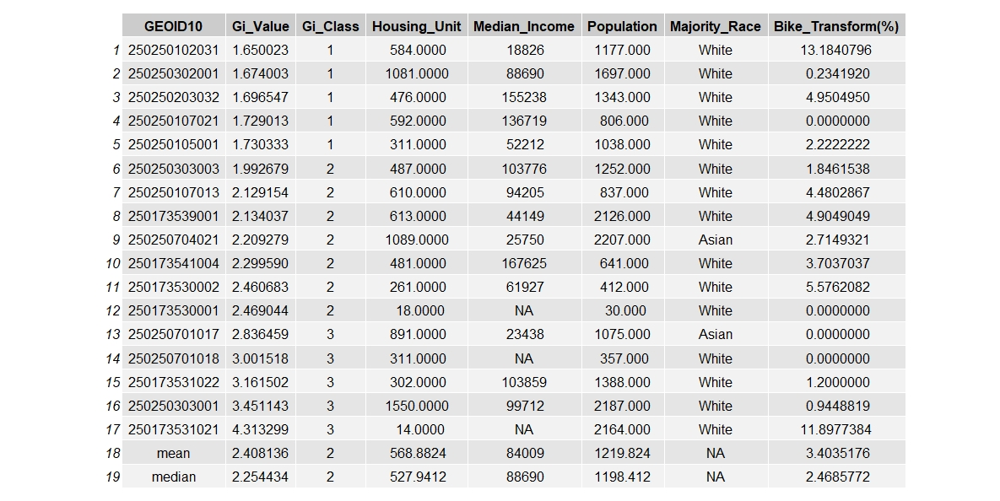
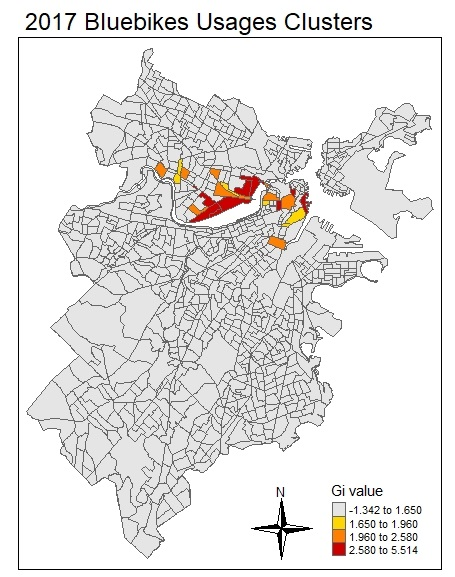
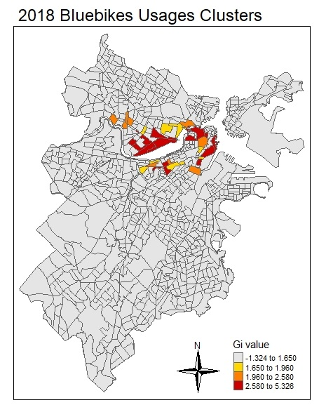

```{r setup, include = FALSE}
knitr::opts_chunk$set(
  collapse = TRUE,
  fig.align = "center",
  comment = "#>"
)
library(knitr)
options(width = 100)
```

# Introduction - PJ

Bike-sharing  system  refers  to  a  public  transportation service system in urban areas offering bikes for shared use to individuals in a relatively short period of time (about 30 − 45 minutes)  for  free  or  with  very  low  charges. Through bike sharing system, people can borrow bikes from nearby stations and return bikes to any stations in the city, which can be used as a alternative to private vehicles and regular public transportation, like buses and subways. As a green way to get around, bike sharing system can relieve the traffic jam in big cities, reduce the emission of harmful gases from motor vehicles, and improve the first mile and last mile connection to other kinds of transits. Therefore, bike sharing system has received more and more attention in recent years. In 2004, there are about 13 bike sharing systems around the world. But now, there are over 850 bike sharing systems globally. More and more big cities have established bike sharing systems, like Chicago (Divvy Bike), San Francisco (Bay Area Bike Share), New York (Citi Bike) and Boston (Bluebikes).

Boston’s original bike sharing system, Hubway, was launched in Boston on July 28, 2011 with 61 stations and 600 bicycles. In 2018, the municipal owners announced a six-year marketing deal with Blue Cross Blue Shield of Massachusetts and relaunch under the name of Bluebikes. From 2011 to 2018, more stations and more bikes were added. Now, Bluebikes has more than 2,500 bikes and over 260 stations across Boston, Brookline, Cambridge and Somerville.

This project aims to explore the usage patterns of Boston’s bike sharing system, Bluebikes, thus help decision makers to manage the bike sharing system more properly, and promote the full use of Bluebikes. The primary objectives includes:

1. Explore the usage of Bluebikess from 2015 to 2018. Visualize how the number of use and trip durations change among different months. Find out which months are people more like to use bike sharing system.

2. Use Linear Regression to figure out if there are any relationships between the number of use and the weather (including temperature and precipitation). Find out what kind of weather are people more like to use bike sharing system.

3. Use hot spot analysis (Getis-Ord Gi) to find out which census blocks are more popular for using bike sharing system and how they changed from 2015 to 2018. Analyze the demographic characteristics in areas of hot/cold spot clusters.

4. Use Gaussian mixture model to process stations trip count data, extract station clusters based on EM algorithm, and comparing major clusters with buffer area of neighboring public transportation routes and colleges to find out latent factors contributing to the use of bike sharing system.

5. Summarize the usage profile of Bluebikes system and explore if there are any improvment suggestions on the system.


# Methods
## Bluebikes’ Trips Exploration - PJ

At this section, we want to explore the usage of Bluebikess from 2015 to 2018 and visualize how the number of use and trip durations change among different months.

Bluebikes’ trips data are downloaded from Bluebikes’ website: https://www.bluebikes.com/system-data.
The data includes following information: trip duration (seconds), start time and date, stop time and date, start station name, start station latitude and longitude, end station name, end station latitude and longitude, bike ID, user type (casual or member), birth year, gender, year and month. The downloaded data is in cvs format, and each month has one cvs file. An example of how the raw data looks like is attached below, the data is from January, 2015. Each row is one trip.

{width=100%}

Analyses is performed on the data from January 2015 to December 2018 in order to generate a comprehensive understanding of the sharing system. We used packages `tidyverse`, `dplyr` and `tidyr` to analysis Bluebikess trips data from 2015 to 2018 and used packages `ggplot2` and `gridExtra` to visualize the data.

The libraries we used include:
```{r, eval = FALSE}
library(dplyr)
library(tidyr)
library(tidyverse)
library(ggplot2)
library(gridExtra)
```

The code to read and format the trips data is attached below. We use `rbind` function to combine monthly data into yearly data. And use `group_by` and `summarize` functions to calculate the number of records by month, mean durations by month and median durations by month. 
```{r, eval = FALSE}
#Read and format bike trip data in 2015
fileName2015 <- list.files(path = "D:/Class/R/FinalProject/Data/2015", full.names = TRUE)
bike2015 <- lapply(fileName2015, read_csv)
bike2015All <- do.call(rbind, bike2015)
bikeByMonth2015 <- bike2015All %>% group_by(month) %>% 
  summarize(records = n(), mean_duration = mean(tripduration),
            median_duration = median(tripduration), year = mean(year))

#Read and format bike trip data in 2016
fileName2016 <- list.files(path = "D:/Class/R/FinalProject/Data/2016", full.names = TRUE)
bike2016 <- lapply(fileName2016, read_csv)
bike2016All <- do.call(rbind, bike2016)
bikeByMonth2016 <- bike2016All %>% group_by(month) %>% 
  summarize(records = n(), mean_duration = mean(tripduration),
            median_duration = median(tripduration), year = mean(year))

#Read and format bike trip data in 2017
fileName2017 <- list.files(path = "D:/Class/R/FinalProject/Data/2017", full.names = TRUE)
bike2017 <- lapply(fileName2017, read_csv)
bike2017All <- do.call(rbind, bike2017)
bikeByMonth2017 <- bike2017All %>% group_by(month) %>% 
  summarize(records = n(), mean_duration = mean(tripduration), 
            median_duration = median(tripduration), year = mean(year))

#Read and format bike trip data in 2018
fileName2018 <- list.files(path = "D:/Class/R/FinalProject/Data/2018", full.names = TRUE)
bike2018 <- lapply(fileName2018, read_csv)
bike2018All <- do.call(rbind, bike2018)
bikeByMonth2018 <- bike2018All %>% group_by(month) %>% 
  summarize(records = n(), mean_duration = mean(tripduration),
            median_duration = median(tripduration), year = mean(year))
```

The code to plot the number of records per month from 2015 - 2018 is attached below. We use `ggplot` to create each year's figure first, and then use `grid.arrange` to format as a 2 by 2 figure.
```{r, eval = FALSE}
# Plot the number of use per month from 2015 - 2018
b1 <- bikeByMonth2015 %>% ggplot(., aes(x = factor(month), y = records)) +
  geom_bar(stat = "identity") +
  ylim(0, 250000) +
  ylab("The number of trips") +
  xlab("Month") +
  ggtitle("The number of trips by month in 2015")

b2 <- bikeByMonth2016 %>% ggplot(., aes(x = month, y = records)) +
  geom_bar(stat = "identity") +
  ylim(0, 250000) +
  scale_x_continuous(breaks=c(1:12)) +
  ylab("") +
  xlab("Month") +
  ggtitle("The number of trips by month in 2016")

b3 <- bikeByMonth2017 %>% ggplot(., aes(x = month, y = records)) +
  geom_bar(stat = "identity") +
  ylim(0, 250000) +
  scale_x_continuous(breaks=c(1:12)) +
  ylab("The number of trips") +
  xlab("Month") +
  ggtitle("The number of trips by month in 2017")

b4 <- bikeByMonth2018 %>% ggplot(., aes(x = month, y = records)) +
  geom_bar(stat = "identity") +
  ylim(0, 250000) +
  scale_x_continuous(breaks=c(1:12)) +
  ylab("") +
  xlab("Month") +
  ggtitle("The number of trips by month in 2018")

grid.arrange(b1, b2, b3, b4, ncol = 2)
```

The method to plot median durations by month is the same as above. The code is attached below.
```{r, eval = FALSE}
# Plot Median Trip Durations
median1 <- bikeByMonth2015 %>% ggplot(., aes(x = month, y = median_duration / 60)) +
  geom_bar(stat = "identity") +
  ylim(0, 15) +
  scale_x_continuous(breaks=c(1:12)) +
  ylab("Median Trip Duration (minutes)") +
  xlab("Month") +
  ggtitle("Median trip durations by month in 2015")

median2 <- bikeByMonth2016 %>% ggplot(., aes(x = month, y = median_duration / 60)) +
  geom_bar(stat = "identity") +
  ylim(0, 15) +
  scale_x_continuous(breaks=c(1:12)) +
  ylab("") +
  xlab("Month") +
  ggtitle("Median trip durations by month in 2016")

median3 <- bikeByMonth2017 %>% ggplot(., aes(x = month, y = median_duration / 60)) +
  geom_bar(stat = "identity") +
  ylim(0, 15) +
  scale_x_continuous(breaks=c(1:12)) +
  ylab("Median Trip Duration (minutes)") +
  xlab("Month") +
  ggtitle("Median trip durations by month in 2017")

median4 <- bikeByMonth2018 %>% ggplot(., aes(x = month, y = median_duration / 60)) +
  geom_bar(stat = "identity") +
  ylim(0, 15) +
  scale_x_continuous(breaks=c(1:12)) +
  ylab("") +
  xlab("Month") +
  ggtitle("Median trip durations by month in 2018")

grid.arrange(median1, median2, median3, median4, ncol = 2)
```

## Linear Regression - PJ

At this section, we want to explore the relationships between the number of trips and the weather (including temperature and precipitation).

We use `ggplot` to create scatterplots to visualize the relationships. And then we use R's `lm` (linear model) function to fit a regression between the number of trips and the weather. The temperature (F) and precipitation (inch) data is downloaded from https://www.usclimatedata.com/climate/boston/massachusetts/united-states/usma0046

Analyses is performed on 4 years data. We use `rbind` to combine 4 years trips data together, and use `cbind` to combine trips data and weather data. The code to prepare data is attached below.
```{r, eval = FALSE}
# Read weather data
weather <- read_csv("D:/Class/R/FinalProject/Data/weather.csv")
# Combine 4 years trips data
trip <- rbind(bikeByMonth2015, bikeByMonth2016, bikeByMonth2017, bikeByMonth2018)
# Combine trips data and weather data
trip_weather <- cbind(weather, trip)
```

The code to create scatterplots is attached below.
```{r, eval = FALSE}
# Scatterplot of temperature and the number of trips
trip_weather %>% ggplot() + geom_point(aes(x = temperature, y = records)) +
  geom_smooth(aes(x = temperature, y = records), method = "lm") +
  xlab("Temperature (F)") + ylab("The number of trips") + 
  ggtitle("Scatterplot of temperature and the number of trips (2015 - 2018)")
# Scatterplot of precipitation and the number of trips
trip_weather %>% ggplot() + geom_point(aes(x = precipitation, y = records)) +
  geom_smooth(aes(x = precipitation, y = records), method = "lm") +
  xlab("Precipitation (inch)") + ylab("The number of trips") + 
  ggtitle("Scatterplot of precipitation and the number of trips (2015 - 2018)")
```

The code to perform linear regression is attached below.
```{r, eval = FALSE}
# Linear regression between the number of trips and temperature
re_tem_lm <- lm(records ~ temperature, data = trip_weather)
summary(re_tem_lm)
# Linear regression between the number of trips and precipitation
re_pre_lm <- lm(records ~ precipitation, data = trip_weather)
summary(re_pre_lm)
```

## Hot Spot Analysis

At this section, we want to use hot spot analysis (Getis-Ord Gi) to find out which census blocks are most popular for using bike sharing system, and how they changed from 2015 to 2018.

### Census Blocks Data Preparation - MZ

Census data at block group scale is used to extract the demographic characteristics. Topics focused in this project are: population race, median household income, housing units, and the percentage of using bike to work.

The source of census data is the estimates of 2017 from 2013-2017 American Community Survey 5-Year Estimates. The following figures visualize the census data, in which grey polygons represent no data. 

{width=45%} 
{width=45%}

{width=45%} 
{width=45%}

{width=45%}

The code to process census data is attached below.
```{r, eval = FALSE}
# Data path
censusPath <- dir("D:/Class/R/test2/Data/SocDem", pattern = ".csv", full.names = TRUE)

# Read in shapefile
sa <- dir(dataPath, pattern = "boston_group.shp", full.names = TRUE) %>%
  st_read() %>% select(COUNTYFP10, GEOID10)

# Read in census data and set the name for each dataset
names <- censusPath %>% basename() %>% strsplit(., "[.]") %>% unlist
census <- censusPath %>% 
  map(function(x) {
    read_csv(x) %>% rename(GEOID10 = Id2) 
  }) %>% set_names(names[!names %in% "csv"])

# Set value 0 to NA
is.na(census$housingunit) <- !census$housingunit
is.na(census$medhincome) <- !census$medhincome

# Add fields for visualization
popdata <- census$poprace %>% select(-GEOID10, -Total)
census$poprace <- census$poprace %>%
  mutate(Majority = colnames(popdata)[max.col(popdata, ties.method = "first")])

census$worktransmeans <- census$worktransmeans %>% 
  mutate(Percentage = Bicycle / Total)
```

### Bike Stations Data Preparation - PJ

Hot Spot Anlysis is based on census blocks. So we need to transform trips data to stations data, and spatial join stations data to census blocks. 

We use 1 more packages at this section: `plyr`.
```{r, eval = FALSE}
library(plyr)
```
To transform trips data to stations data, first, we group trips data by start station name, and calculate how many trips start from each station. Second, we group trips data by end station name, and calculate how many trips end at each station. Third, we join the results from the above two steps together. Finally, we calculate the total trips for each station (trips start from one station plus trips end at that station). The code to transform trips data to stations data is attached below.
```{r, eval = FALSE}
# Create a list contains 4 years data
bikeAll <- list(bike2015All, bike2016All, bike2017All, bike2018All)
# Group trips data by start station name, calculate how many trips start from each stations.
s_station <- lapply(bikeAll, function(x){
  x <- x %>% group_by(`start station name`) %>% 
    summarize(s_records = n(), Latitude = mean(`start station latitude`), 
              Longitude = mean(`start station longitude`)) %>% 
    rename(Station = `start station name`, s_records = s_records)
  return(x)
})
# Group trips data by end station name, calculate how many trips end at each stations.
e_station <- lapply(bikeAll, function(x){
  x <- x %>% group_by(`end station name`) %>% 
    summarize(e_records = n()) %>% 
    rename(Station = `end station name`, e_records = e_records)
  return(x)
})
# Join trips start from each stations with trips end at each stations. 
station_records2015 <- full_join(x = s_station[[1]], y = e_station[[1]], by = "Station")
station_records2016 <- full_join(x = s_station[[2]], y = e_station[[2]], by = "Station")
station_records2017 <- full_join(x = s_station[[3]], y = e_station[[3]], by = "Station")
station_records2018 <- full_join(x = s_station[[4]], y = e_station[[4]], by = "Station")
# Join records with station, calculate the number of all records
station2015 <- full_join(x = station, y = station_records2015, by = c("Latitude", "Longitude") ) %>% 
  mutate(all_records = s_records + e_records) %>% drop_na(all_records)
station2016 <- full_join(x = station, y = station_records2016, by = c("Latitude", "Longitude") ) %>% 
  mutate(all_records = s_records + e_records) %>% drop_na(all_records)
station2017 <- full_join(x = station, y = station_records2017, by = c("Latitude", "Longitude") ) %>% 
  mutate(all_records = s_records + e_records) %>% drop_na(all_records)
station2018 <- full_join(x = station, y = station_records2018, by = c("Latitude", "Longitude") ) %>% 
  mutate(all_records = s_records + e_records) %>% drop_na(all_records)
```
station2015 looks like this:
{width=98%} 

To spatial join stations data to census blocks, first, we transform station data to sf object. Second, we use `st_join` to spatial join stations data to census blocks. The code is attached below.
```{r, eval = FALSE}
# Transform station data to sf
stationAll <- list(station2015, station2016, station2017, station2018)
stationAll_sf <- lapply(stationAll, function(x){
  x <- x %>% st_as_sf(., coords = c("Longitude", "Latitude"), crs = 4326) %>% 
    st_transform(x = ., crs = st_crs(sa)) %>% rename(ID = `Station ID`,
                                                     address = Station.x, 
                                                     name = Station.y,
                                                     docks = "# of Docks")
  return(x)
})
# Spatial join stations to census
censusAll_sf <- lapply(stationAll_sf, function(x){
  return(st_join(sa, x, join = st_intersects) %>% filter(all_records != 0) %>% 
           select(GEOID10, Municipality, s_records, e_records, all_records, geometry))
})
```
After spatial join, there will be duplicate census blocks, since more than one stations may fall inside the same census block. Therefore, we need to sum the records for the features in `censusAll_sf` that have the same census block's ID. The code is attached below.
```{r, eval = FALSE}
# Summarize all_records for features have same GEOID10
allSum2015 <- ddply(censusAll_sf[[1]],.(GEOID10),summarize,sum_all_records = sum(all_records))
# Summarize s_records for features have same GEOID10
sSum2015 <- ddply(censusAll_sf[[1]],.(GEOID10),summarize,sum_s_records = sum(s_records))
# Summarize e_records for features have same GEOID10
eSum2015 <- ddply(censusAll_sf[[1]],.(GEOID10),summarize,sum_e_records = sum(e_records))
# Join above 3 together
censusSum2015 <- censusAll_sf[[1]] %>% left_join(., allSum2015, by = "GEOID10") %>% 
  left_join(., sSum2015, by = "GEOID10") %>% left_join(., eSum2015, by = "GEOID10") %>% 
  distinct(., GEOID10, .keep_all = TRUE)

# The same process for 2016
allSum2016 <- ddply(censusAll_sf[[2]],.(GEOID10),summarize,sum_all_records = sum(all_records))
sSum2016 <- ddply(censusAll_sf[[2]],.(GEOID10),summarize,sum_s_records = sum(s_records))
eSum2016 <- ddply(censusAll_sf[[2]],.(GEOID10),summarize,sum_e_records = sum(e_records))
censusSum2016 <- censusAll_sf[[2]] %>% left_join(., allSum2016, by = "GEOID10") %>% 
  left_join(., sSum2016, by = "GEOID10") %>% left_join(., eSum2016, by = "GEOID10") %>% 
  distinct(., GEOID10, .keep_all = TRUE)
# The same process for 2017
allSum2017 <- ddply(censusAll_sf[[3]],.(GEOID10),summarize,sum_all_records = sum(all_records))
sSum2017 <- ddply(censusAll_sf[[3]],.(GEOID10),summarize,sum_s_records = sum(s_records))
eSum2017 <- ddply(censusAll_sf[[3]],.(GEOID10),summarize,sum_e_records = sum(e_records))
censusSum2017 <- censusAll_sf[[3]] %>% left_join(., allSum2017, by = "GEOID10") %>% 
  left_join(., sSum2017, by = "GEOID10") %>% left_join(., eSum2017, by = "GEOID10") %>% 
  distinct(., GEOID10, .keep_all = TRUE)
# The same process for 2018
allSum2018 <- ddply(censusAll_sf[[4]],.(GEOID10),summarize,sum_all_records = sum(all_records))
sSum2018 <- ddply(censusAll_sf[[4]],.(GEOID10),summarize,sum_s_records = sum(s_records))
eSum2018 <- ddply(censusAll_sf[[4]],.(GEOID10),summarize,sum_e_records = sum(e_records))
censusSum2018 <- censusAll_sf[[4]] %>% left_join(., allSum2018, by = "GEOID10") %>% 
  left_join(., sSum2018, by = "GEOID10") %>% left_join(., eSum2018, by = "GEOID10") %>% 
  distinct(., GEOID10, .keep_all = TRUE)

# Join 4 years together as a list
censusAll_sf <- list(censusSum2015, censusSum2016, censusSum2017, censusSum2018)
```

`censusAll_sf[1]` is like this:

{width=98%} 

### Hot Spot Analysis - PJ

To perform hot spot analysis, we use `localG` function from `spdep` package. `localG` works on sp object, so we use package `sp` to transform sf object to sp object. We use `tmap` package to visualize the results.
```{r, eval = FALSE}
library(sp)
library(spdep)
library(tmap)
```
The code to perform hot spot analysis is attached below. First, we transform sf object to sp object. Second, we use `poly2nb` to define neighbour and `nb2listw` to define neighbour weight. Third, we use `localG` to calculate Getis-Ord Gi values. Finally, we add Getis-Ord Gi values to census blocks. 
```{r, eval = FALSE}
# Transform sf object to sp object
censusAll_sp <- lapply(censusAll_sf, function(x){return(as(x, "Spatial"))})
# Define Neighbour
censusAll_nb <- lapply(censusAll_sp, function(x){return(poly2nb(x, queen = TRUE))})
# Define Neighbour Weight
censusAll_w <- lapply(censusAll_nb, function(x){return(nb2listw(x, style = "W", 
                                                                zero.policy = TRUE))})
# Calculate local G
localg_SE <- mapply(function(X, Y){
  localG(X$all_records, Y)
}, X = censusAll_sp, Y = censusAll_w)

# Add local G value to census data
census_G2015 <- censusAll_sf[[1]] %>% mutate(G_SE = as.numeric(localg_SE[[1]])) %>% drop_na(G_SE)
census_G2016 <- censusAll_sf[[2]] %>% mutate(G_SE = as.numeric(localg_SE[[2]])) %>% drop_na(G_SE)
census_G2017 <- censusAll_sf[[3]] %>% mutate(G_SE = as.numeric(localg_SE[[3]])) %>% drop_na(G_SE)
census_G2018 <- censusAll_sf[[4]] %>% mutate(G_SE = as.numeric(localg_SE[[4]])) %>% drop_na(G_SE)
```

To visualize the results of hot spot analysis, we use `tmap` package. The code to plot clusters is attached below.
```{r, eval = FALSE}
# 2015 Hot Spot Map - All Usages
breaks <- c(min(census_G2015$G_SE), 1.65, 1.96, 2.58, 
            max(census_G2015$G_SE))
mycols <- colors()[c(243, 142, 91, 555)]
tmap_mode('plot')
tm_shape(sa, unit = "mi") + tm_polygons(col = colors()[243]) +
  tm_shape(census_G2015, unit = "mi") +
  tm_polygons(col = "G_SE", title = "Gi value", palette = mycols,
              breaks = breaks) +
  tm_compass(type = "4star", position = c("right", "bottom")) + 
  tm_layout(frame = T, main.title = "2015 Bluebikes Usages Clusters",
            legend.outside = F) 
# 2016 Hot Spot Map - All Usages
breaks <- c(min(census_G2016$G_SE), 1.65, 1.96, 2.58, 
            max(census_G2016$G_SE))
mycols <- colors()[c(243, 142, 91, 555)]
tm_shape(sa, unit = "mi") + tm_polygons(col = "grey90") +
  tm_shape(census_G2016, unit = "mi") +
  tm_polygons(col = "G_SE", title = "Gi value", palette = mycols,
              breaks = breaks) +
  tm_compass(type = "4star", position = c("right", "bottom")) + 
  tm_layout(frame = T, main.title = "2016 Bluebikes Usages Clusters",
            legend.outside = F) 
# 2017 Hot Spot Map - All Usages
breaks <- c(min(census_G2017$G_SE), 1.65, 1.96, 2.58, 
            max(census_G2017$G_SE))
tm_shape(sa, unit = "mi") + tm_polygons(col = "grey90") +
  tm_shape(census_G2017, unit = "mi") +
  tm_polygons(col = "G_SE", title = "Gi value", palette = mycols,
              breaks = breaks) +
  tm_compass(type = "4star", position = c("right", "bottom")) + 
  tm_layout(frame = T, main.title = "2017 Bluebikes Usages Clusters",
            legend.outside = F) 
# 2018 Hot Spot Map - All Usages
breaks <- c(min(census_G2018$G_SE), 1.65, 1.96, 2.58, 
            max(census_G2018$G_SE))
tm_shape(sa, unit = "mi") + tm_polygons(col = "grey90") +
  tm_shape(census_G2018, unit = "mi") +
  tm_polygons(col = "G_SE", title = "Gi value", palette = mycols,
              breaks = breaks) +
  tm_compass(type = "4star", position = c("right", "bottom")) + 
  tm_layout(frame = T, main.title = "2018 Bluebikes Usages Clusters",
            legend.outside = F) 
```


### Demographic Characteristics Exploration - PJ
In order to extract demographic Characteristics, we create 2 functions. `join_census` join census information to hot and cold clusters. Census information includes housing units, median household income, population, majority race, and the percentage of using bikes to work. `G_Class` categorize Getis-Ord Gi values into 7 classes. Following table explains the meaning of each class.
```{r, echo=FALSE}
mat <- rbind(c(-3, "Cold spot at 99% significance level"), 
             c(-2, "Cold spot at 95% significance level"), 
             c(-1, "Cold spot at 90% significance level"),
             c(1, "Hot spot at 90% significance level"), 
             c(2, "Hot spot at 95% significance level"), 
             c(3, "Hot spot at 99% significance level"))
DF <- as.data.frame(mat, stringsAsFactors = FALSE)
colnames(DF) <- c("Class", "Explanation")
kable(DF, align = "r")
```

The code of function `G_Class` and `join_census` is attached below.
```{r, eval = FALSE}
G_Class <- function(x){
  x_class <- x %>% 
    # categorize All Usages Clusters
    mutate(GSE_Class = ifelse(G_SE <= -2.58, -3, 0)) %>%
    mutate(GSE_Class = ifelse(G_SE >= 2.58, 3, GSE_Class)) %>%      
    mutate(GSE_Class = ifelse((G_SE > -2.58 & G_SE <= -1.96), -2, GSE_Class)) %>% 
    mutate(GSE_Class = ifelse((G_SE < 2.58 & G_SE >= 1.96), 2, GSE_Class)) %>% 
    mutate(GSE_Class = ifelse((G_SE > -1.96 & G_SE < -1.65), -1, GSE_Class)) %>% 
    mutate(GSE_Class = ifelse((G_SE < 1.96 & G_SE > 1.65), 1, GSE_Class)) %>% 
    as_tibble()
  return(join_census(x_class))
}
join_census <- function(x){
  y <- x %>% 
    filter(GSE_Class >= 1 | GSE_Class <= -1) %>% 
    left_join(., housingunit, by = "GEOID10") %>% 
    left_join(., medianincome, by = "GEOID10") %>% 
    left_join(., poprace, by = "GEOID10") %>% 
    left_join(., worktransf, by = "GEOID10") %>% 
    select(GEOID10, "Gi_Value" = G_SE, "Gi_Class" = GSE_Class,
           "Housing_Unit" = housingunit, "Median_Income" = medianincome,
           "Population" = popnumber, "Majority_Race" = majorityrace, 
           "Bike_Transform(%)" = biketransf) %>% arrange(Gi_Value)
  return(y)
}
```

The code to extract demographic Characteristics for hot spots and cold spots is attached below. First, we change census data to tibble and format data. Then, we use `G_Class` function to extract demographic Characteristics of hot spots and cold spots for each year. Finally, we use `grid.table` from `grid` package to plot tables.
```{r, eval = FALSE}
# Change housing units data to tibble and format data
housingunit <- censusshp$housingunit %>% as_tibble() %>% select(GEOID10, Total) %>% 
  rename(housingunit = Total)
# Change median income data to tibble and format data
medianincome <- censusshp$medhincome %>% as_tibble() %>% select(GEOID10, Income) %>% 
  rename(medianincome = Income)
# Change population data to tibble and format data
poprace <- censusshp$poprace %>% as_tibble() %>% select(GEOID10, Total, Majority) %>% 
  rename(popnumber = Total, majorityrace = Majority)
# Change the percentage of using bikes to work to tibble and format data
worktransf <- censusshp$worktransmeans %>% as_tibble() %>% 
  select(GEOID10, Percentage) %>% mutate(Percentage = Percentage * 100) %>% 
  rename(biketransf = Percentage)

# Use G_Class function to extract demographic Characteristics
summarytable2015 <- G_Class(census_G2015)
summarytable2016 <- G_Class(census_G2016)
summarytable2017 <- G_Class(census_G2017)
summarytable2018 <- G_Class(census_G2018)

# Plot table for 2015
library(grid)
summarytable2015 %>% 
  add_row(GEOID10 = "mean", Gi_Value = mean(.$Gi_Value), Gi_Class = mean(.$Gi_Class), 
          Housing_Unit = mean(.$Housing_Unit),
          Median_Income = mean(.$Median_Income, na.rm = TRUE),
          Population = mean(.$Population), 
          `Bike_Transform(%)` = mean(.$`Bike_Transform(%)`)) %>% 
  add_row(GEOID10 = "median", Gi_Value = median(.$Gi_Value), 
          Gi_Class = median(.$Gi_Class), Housing_Unit = median(.$Housing_Unit),
          Median_Income = median(.$Median_Income, na.rm = TRUE),
          Population = median(.$Population), 
          `Bike_Transform(%)` = median(.$`Bike_Transform(%)`)) %>% grid.table()
```

## Model Based Clustering (Gaussian mixture model)
In this section, our goals are: 

1) to extract station clusters based on the annually usage profile at the scale of monthly data; 

2) to analyze and summarize the characteristics of major clusters, and further understand the performance Bluebikes system by comparing major clusters throughout the four years; 

3) to join interested clusters with buffer area of public transportation routes and colleges, and find out potential factors determining their usage characteristics.

### Monthly Station Usage Profile Preperation - MZ
For Gaussian mixture model based clustering, we designed three types of usage profiles for each year: 

1) origin usage profile: a data frame organized by station ID (column name: sid), containing multiple columns of monthly total of trips in which each station serves as origins (column names: s1, s2, …, s12) and a column of median trip duration when each station serves as origins (column name: sduration); 

2) destination usage profile: a data frame organized by station ID (column name: sid), containing multiple columns of monthly total of trips in which each station serves as destinations (column names: e1, e2, …, e12) and a column of median trip duration when each station serves as destinations (column name: eduration); 

3) all usage profile: a data frame created by join the two profile data frames described in 1) and 2) by station ID (sid), containing independent columns of origin or destination usage (column names: s1, s2, …, s12, e1, e2, …, e12) and two columns of median trip duration when each station serves as origins or destinations respectively (column names: sduration, eduration).

The three types of usage profiles can be generated from the dataset of trip records from 2015 to 2018. First, we read in the trip records of each year into an independent list where records for each month stored in data frame. Then we use `rbind()` to combine monthly datasets into an annual data frame. `na.omit()` is used to remove rows with missing records. 

The code for this step is attached below. The code for 2015 dataset is shown as example, those for 2016, 2017 and 2018 are omitted for conciseness. If intereseted, please check "Model Based Clustering" vignette for reference.

```{r, eval = FALSE}
# file path
Path15 <- dir("D:/R_final/BikeSharing_project/BlueBike/2015", 
                  pattern = ".csv", full.names = TRUE)

# Read in trip data
names15 <- Path15 %>% basename() %>% substr(., start = 1, stop = 13)
trips15 <- Path15 %>% 
   purrr::map(function(x) {
     read_csv(x) %>% 
       select("tripduration", "starttime",  "stoptime",
              "start station id", "end station id", "year", "month") %>%
       rename(origin = "start station id", destination = "end station id") %>% 
       mutate(origin = as.character(origin), 
              destination = as.character(destination)) %>% 
       mutate(c1 = as.character(starttime)) %>%
       mutate(c2 = as.character(stoptime)) %>%
       mutate(mdY = sub("\\s+.*", "", c1)) %>% 
       mutate(weekday = as.Date(mdY, "%m/%d/%Y") %>% weekdays()) %>% 
       mutate(shour = sub(":+.*", "", sub("*.+\\s", "", c1))) %>% 
       mutate(ehour = sub(":+.*", "", sub("*.+\\s", "", c2))) %>% 
       mutate(tripcount = 1) %>% 
       select(-c1, -c2)
   }) %>% set_names(names15)

# Combine monthly datasets into annual data frames
df15 <- do.call("rbind", trips15) %>% na.omit()
```

Three usage profiles of 2015 are created from the annual data frame just created. The code to create three usage profiles of 2015 is attached below. The code to create profile of 2016, 2017 and 2018 is almost identical to this one, therefore it is not shown in this vignette for conciseness. If interested, please use “Model Based Clustering” vignette for reference. 
```{r, eval = FALSE}
# Annual summary by monthly usage profile
# Year 2015
# Station as origin
df15_start <- 
  df15 %>% select(origin, tripduration, tripcount, month) %>%
  group_by(origin, month) %>% 
  summarise_all(funs(sum, median)) %>% 
  select(origin, tripcount_sum, tripduration_median, month) %>% 
  rename(sid = origin, 
         scount = tripcount_sum, sduration = tripduration_median)

# Count the total number of origin usage by month
df15_startc <- df15_start %>% spread(month, scount) %>% rename(s1 = "1", s2 = "2",
                                                s3 = "3", s4 = "4",
                                                s5 = "5", s6 = "6",
                                                s7 = "7", s8 = "8",
                                                s9 = "9", s10 = "10",
                                                s11 = "11", s12 = "12") %>% 
  select(-sduration)
# Convert NA to ""
df15_startc[is.na(df15_startc)] <- ""

# Merge rows ---> data for one station (sid) store in a singal row
df15_startc <- df15_startc %>% group_by(sid) %>%
  summarise_all(funs(trimws(paste(., collapse = ''))))
# Convert the class of hourly count from string to numeric
cols.num <- paste0("s", 1:12)
df15_startc[cols.num] <- sapply(df15_startc[cols.num], as.numeric)
# Fill no data with 0
df15_startc[is.na(df15_startc)] <- 0

# Get the annually median trip duration for each station
df15_startd <- 
  df15 %>% select(origin, tripduration) %>%
  group_by(origin) %>% 
  summarise_all(funs(median)) %>% 
  rename(sid = origin, 
         sduration = tripduration)

# Station (origin) usage profile
df15_startP <- left_join(df15_startc, df15_startd, by = "sid")

### Station as destination
df15_end <- 
  df15 %>% select(destination, tripduration, tripcount, month) %>%
  group_by(destination, month) %>% 
  summarise_all(funs(sum, median)) %>% 
  select(destination, tripcount_sum, tripduration_median, month) %>% 
  rename(sid = destination, 
         scount = tripcount_sum, sduration = tripduration_median)

# Count the total number of destination usage by month
df15_endc <- df15_end %>% spread(month, scount) %>% rename(e1 = "1", e2 = "2",
                                                e3 = "3", e4 = "4",
                                                e5 = "5", e6 = "6",
                                                e7 = "7", e8 = "8",
                                                e9 = "9", e10 = "10",
                                                e11 = "11", e12 = "12") %>% 
  select(-sduration)
# Convert NA to ""
df15_endc[is.na(df15_endc)] <- ""

# Merge rows ---> data for one station (sid) store in a singal row
df15_endc <- df15_endc %>% group_by(sid) %>%
  summarise_all(funs(trimws(paste(., collapse = ''))))
# Convert the class of hourly count from string to numeric
cols.num <- paste0("e", 1:12)
df15_endc[cols.num] <- sapply(df15_endc[cols.num], as.numeric)
# Fill no data with 0
df15_endc[is.na(df15_endc)] <- 0

# Get the annually median trip duration for each station
df15_endd <- 
  df15 %>% select(destination, tripduration) %>%
  group_by(destination) %>% 
  summarise_all(funs(median)) %>% 
  rename(sid = destination, 
         eduration = tripduration)

# Station (destination) usage profile
df15_endP <- left_join(df15_endc, df15_endd, by = "sid")

# Station usage profile
df15_P <- full_join(df15_startP, df15_endP, by = "sid")
# Convert NA to 0
df15_P[is.na(df15_P)] <- 0
```


### Buffer Preperation - MZ
Public transportation route and the location of colleges could be factors indicating the characteristics of neighborhoods and affecting the usage of Bluebikes. Varied buffer areas are created to explore the spatial relationship between them and stations in interested clusters, and they are: 1) 200-meter, 500-meter and 1000-meter buffers from colleges, 2) a 50-meter buffer from bus routes, 3) a 100-meter buffer from subway routes. The code to read in shape files and create buffers from them is attached below. ` st_zm()` is used to transform the original data as GEOS does not support 3-dimensional geometries.

```{r, eval = FALSE}
# Read shape files
dataPath <- "D:/R_final/BikeSharing_project/BostonBikeSharingSystem/Data/SocDem"
subway <- dir(dataPath, pattern = "subway.shp", full.names = TRUE) %>%
  st_read()
bus <- dir(dataPath, pattern = "busroute.shp", full.names = TRUE) %>%
  st_read()
colleges <- dir(dataPath, pattern = "universities.shp", full.names = TRUE) %>%
  st_read()

# Create buffer area
bus2 <- st_zm(bus)
subway2 <- st_zm(subway)

b_college <- lapply(c(200, 500, 1000), function(x){
  buffer <- colleges %>% select(COLLEGE) %>% 
    st_buffer(dist = x) %>% st_union()
  return(buffer)
})

b_bus <- bus2 %>%
  st_buffer(dist = 50) %>% st_union()

b_subway <- subway2 %>%
  st_buffer(dist = 100) %>% st_union()

buffer <- list(b_college[[1]],  b_college[[2]], b_college[[3]],
               b_bus, b_subway)
```


### Model Based Clustering - MZ
Package `mclust` is used to extract station clusters based on Gaussian mixture model and EM algorithm. `classification` in the result records the cluster code each station assigned based on BIC in EM algorithm, which is allocated into corresponding station profile for further analyses and visualization. The code for this step is attached below.

```{r, eval = FALSE}
# Model Based Clustering
# 2015
# origin usage profile
fit15_1 <- Mclust(df15_startP)
# destination usage profile
fit15_2 <- Mclust(df15_endP)
# all usage profile
fit15_3 <- Mclust(df15_P)

# 2016
# origin usage profile
fit16_1 <- Mclust(df16_startP)
# destination usage profile
fit16_2 <- Mclust(df16_endP)
# all usage profile
fit16_3 <- Mclust(df16_P)

# 2017
# origin usage profile
fit17_1 <- Mclust(df17_startP)
# destination usage profile
fit17_2 <- Mclust(df17_endP)
# all usage profile
fit17_3 <- Mclust(df17_P)
# 2018
# origin usage profile
fit18_1 <- Mclust(df18_startP)
# destination usage profile
fit18_2 <- Mclust(df18_endP)
# all usage profile
fit18_3 <- Mclust(df18_P)

### Allocate clustering code C
df15_startP <- df15_startP %>% mutate(C = fit15_1$classification)
df15_endP <- df15_endP %>% mutate(C = fit15_2$classification)
df15_P <- df15_P %>% mutate(C = fit15_3$classification)

df16_startP <- df16_startP %>% mutate(C = fit16_1$classification)
df16_endP <- df16_endP %>% mutate(C = fit16_2$classification)
df16_P <- df16_P %>% mutate(C = fit16_3$classification)

df17_startP <- df17_startP %>% mutate(C = fit17_1$classification)
df17_endP <- df17_endP %>% mutate(C = fit17_2$classification)
df17_P <- df17_P %>% mutate(C = fit17_3$classification)

df18_startP <- df18_startP %>% mutate(C = fit18_1$classification)
df18_endP <- df18_endP %>% mutate(C = fit18_2$classification)
df18_P <- df18_P %>% mutate(C = fit18_3$classification)

```


### Cluster Analysis and Visualization - MZ
Now we have three profiles with allocated cluster code for each year. `summary()` returns the a general description of cluster in each profile, which helps us to identify two major clusters of maximum number of components (stations). Figure below is an example of summarized result for origin usage profile in 2015.
```{r, eval = FALSE}
summary(fit15_1)
```
{width=65%}


Based on the return of `summary()` and the number of stations in each profile, the summary information of usage profile are presented in the table below. The number of stations was increasing throughout 2015 to 2018, particularly gained a significant increase between 2017 and 2018. In most cases from 2015 to 2017, the two largest (major) clusters contains around or more than two thirds of stations in the usage profile. However, there are more stations falling in other clusters in 2018 comparing to the cases in 2015, 2016 and 2017. It is potential that the Bluebikes system of 2018 became quite different from that of 2015, which would be compared after exploring the all usage profiles for each year.
```{r, echo=FALSE}
mat <- rbind(c("Origin 2015", 156, 4, "2,3", 71, 46, 0.25), 
             c("Destination 2015", 156, 7, "4, 7", 38, 32, 0.55), 
             c("All 2015", 156, 2, "1, 2", 93, 63, 0.00),
             c("Origin 2016", 189, 3, "1, 2", 93, 58, 0.12), 
             c("Destination 2016", 189, 5, "2, 4", 92, 44, 0.28), 
             c("All 2016", 189, 4, "2, 3", 71, 63, 0.29),
             c("Origin 2017", 200, 3, "1, 2", 100, 58, 0.21),
             c("Destination 2017", 200, 3, "2, 3", 85, 58, 0.29),
             c("All 2017", 200, 3, "1, 2", 110, 69, 0.11),
             c("Origin 2018", 314,5, "2, 1", 126, 82, 0.34),
             c("Destination 2018", 317, 6, "1, 2", 101, 82, 0.42),
             c("All 2018", 315, 6, "2, 1", 84, 73, 0.50))
DF <- as.data.frame(mat, stringsAsFactors = FALSE)
colnames(DF) <- c("Usage Profile", "Number of Stations", "Number of Clusters",
                  "Major Clusters", "Number of Stations in Major Cluster 1",
                  "Number of Stations in Major Cluster 2",
                  "% Stations in Other Clusters")
kable(DF, align = "r")
```

In order to have a general understanding of Bluebikes usage profiles across the four years, we need to visualize the clusters on map, which requires GPS coordinates excluded in the profile. We first reread the raw datasets to extract stations’ coordinate information and then join it to the usage profiles. As mentioned before, the number of stations increased very year, and the IDs and names of stations might change, thus we couldn’t create a general dataset of station coordinates. Instead, we reread the raw dataset and generate a unique data frame of station coordinates for each year. After join station coordinates to usage profiles, we used package `tmap` to visualize the clusters on map. The code below is an example of the process for year 2015’s profiles. The code for other years’ are identical but is omitted in this vignette for conciseness. If interested, please use “Model Based Clustering” vignette for reference. (Note: a few records were deleted from 2018 destination and all use profile due to missing coordinates.)
```{r, eval=FALSE}
library(tmap)
library(tmaptools)

# Read raw dataset for the station latlon information
station15 <- Path15 %>% 
   purrr::map(function(x) {
     read_csv(x) %>% 
       select("start station id", "start station name",
              "start station latitude", "start station longitude") %>%
       rename(sid = "start station id", sname = "start station name",
              lat = "start station latitude", lon = "start station longitude") %>%
       mutate(sid  = as.character(sid)) %>%
       distinct(sid, sname, lat, lon)
   }) %>% set_names(names15)

# Combine monthly datasets into annual data frames
# sn1X store sid and the latlon information of stations used in 201x
# 2015
sn15 <- do.call("rbind", station15) %>% 
  na.omit() %>% distinct(sid, lat, lon)
# Delet duplicated rows caused by slight diffrecences in lat/lon
sn15 <- sn15[!duplicated(sn15$sid), ]

# Visualize annually bike clusters
# Get sid and cluster code (C)
c15_startP <- df15_startP %>% select(sid, C) %>% mutate(C = as.character(C))
c15_endP <- df15_endP %>% select(sid, C) %>% mutate(C = as.character(C))
c15_P <- df15_P %>% select(sid, C) %>% mutate(C = as.character(C))

# Join cluster code (C) and latlon, transform df to sf
# 2015
c15_s <- left_join(c15_startP, sn15, by = "sid") %>% 
  st_as_sf(., coords = c("lon", "lat"), crs = 4326) %>%
  st_transform(x = ., crs = st_crs(sa))
c15_e <- left_join(c15_endP, sn15, by = "sid") %>% 
  st_as_sf(., coords = c("lon", "lat"), crs = 4326) %>%
  st_transform(x = ., crs = st_crs(sa))
c15_P <- left_join(c15_P, sn15, by = "sid") %>% 
  st_as_sf(., coords = c("lon", "lat"), crs = 4326) %>%
  st_transform(x = ., crs = st_crs(sa))

# Plot clusters
tmap_mode("plot")

# 2015
p15_s <- tm_shape(censusshp$poprace %>% st_union) +
  tm_polygons(col = "grey") +
tm_shape(bus2) +
  tm_lines(col = "honeydew2") +
tm_shape(subway2) +
  tm_lines(col = "orange") +
tm_shape(c15_s) +
  tm_dots(shape = 16, size = .15, col = "C", title = "Cluster") +
tm_add_legend(type = "line", labels = "Bus Routes", col = "honeydew2") +
tm_add_legend(type = "line", labels = "Subway Routes", col = "orange") +
tm_layout(main.title = 
            "Station Usage Profile Cluster \n- Origin Service 2015",
          legend.outside = TRUE, legend.outside.position = "bottom",
          legend.stack = "horizontal", legend.title.size = .5,
          main.title.size = .8) +
tm_compass(type = "4star", size = 1, show.labels = 0)
tmap_save(p15_s, filename = "../vignettes/fig/clusters2015_s.png")

p15_e <- tm_shape(censusshp$poprace %>% st_union) +
  tm_polygons(col = "grey") +
tm_shape(bus2) +
  tm_lines(col = "honeydew2") +
tm_shape(subway2) +
  tm_lines(col = "orange") +
tm_shape(c15_e) +
  tm_dots(shape = 16, size = .15, col = "C", title = "Cluster") +
tm_add_legend(type = "line", labels = "Bus Routes", col = "honeydew2") +
tm_add_legend(type = "line", labels = "Subway Routes", col = "orange") +
tm_layout(main.title = 
            "Station Usage Profile Cluster \n- Destination Service 2015",
          legend.outside = TRUE, legend.outside.position = "bottom",
          legend.stack = "horizontal", legend.title.size = .5,
          main.title.size = .8) +
tm_compass(type = "4star", size = 1, show.labels = 0)
tmap_save(p15_e, filename = "../vignettes/fig/clusters2015_e.png")

p15_P <- tm_shape(censusshp$poprace %>% st_union) +
  tm_polygons(col = "grey") +
tm_shape(bus2) +
  tm_lines(col = "honeydew2") +
tm_shape(subway2) +
  tm_lines(col = "orange") +
tm_shape(c15_P) +
  tm_dots(shape = 16, size = .15, col = "C", title = "Cluster") +
tm_add_legend(type = "line", labels = "Bus Routes", col = "honeydew2") +
tm_add_legend(type = "line", labels = "Subway Routes", col = "orange") +
tm_layout(main.title = 
            "Station Usage Profile Cluster \n- All Service 2015",
          legend.outside = TRUE, legend.outside.position = "bottom",
          legend.stack = "horizontal", legend.title.size = .5,
          main.title.size = .8) +
tm_compass(type = "4star", size = 1, show.labels = 0)
tmap_save(p15_P, filename = "../vignettes/fig/clusters2015_P.png")

p15 <- tmap_arrange(p15_s, p15_e, p15_P)
tmap_save(p15, filename = "../vignettes/fig/clusters2015.png")
```

After exploring the spatial distribution of clusters, we use bar charts and histograms to find out the statistical distribution of two major clusters in all-usage profile of each year. `ggplot` helps us draw bar charts of average number of trips by month and histograms of trip duration (unit: mins) distributions. The code below is an example of the process for year 2015’s major clusters in all-usage profile. The code for other years’ are identical but is omitted in this vignette for conciseness. If interested, please use “Model Based Clustering” vignette for reference.
```{r, eval=FALSE}
### Major Profile Plot
# 2015 all usage
# Generate data to draw trip profile
usage <- c(rep("Origins", 12), rep("Destinations", 12))
mth <- c(1:12, 1:12)

sumdf15_P1 <- colSums(df15_P %>% 
                       filter(C == "1") %>% 
                       select(-sid, -C, -sduration, -eduration))
pro15_P1 <- data.frame(trips = (sumdf15_P1 / nrow(df15_P)), 
                       Usage = usage, Month = mth)

sumdf15_P2 <- colSums(df15_P %>% 
                       filter(C == "2") %>% 
                       select(-sid, -C, -sduration, -eduration))
pro15_P2 <- data.frame(trips = (sumdf15_P2 / nrow(df15_P)), 
                       Usage = usage, Month = mth)

# Generate data for duration profile
ddf15_P1 <- df15_P %>% filter(C == "1")
dusage <- c(rep("Origins", nrow(ddf15_P1)), 
            rep("Destinations", nrow(ddf15_P1)))
pro15_Pd1 <- 
  data.frame(Duration = c((ddf15_P1$sduration / 60), (ddf15_P1$eduration / 60)),
             Usage = dusage)

ddf15_P2 <- df15_P %>% filter(C == "2")
dusage <- c(rep("Origins", nrow(ddf15_P2)), 
            rep("Destinations", nrow(ddf15_P2)))
pro15_Pd2 <- 
  data.frame(Duration = c((ddf15_P2$sduration / 60), (ddf15_P2$eduration / 60)),
             Usage = dusage)

p15_proP1 <- pro15_P1 %>% 
  ggplot(., aes(x = factor(Month), y = trips, 
                fill = Usage), bins = 15) +
  geom_bar(stat = "identity") +
  ylim(0, 1500) +
  ylab("The average number of trips") +
  xlab("Month") +
  labs(title = "2015 All Service Cluster 1 Usage Profile",
       subtitle = "Average number of trips by month")
ggsave("2015pro_P1.png", path = "../vignettes/fig", dpi = 120,
       width = 8, height = 8, units = "in")

p15_proP2 <- pro15_P2 %>% 
  ggplot(., aes(x = factor(Month), y = trips, 
                fill = Usage), bins = 15) +
  geom_bar(stat = "identity") +
  ylim(0, 1500) +
  ylab("The average number of trips") +
  xlab("Month") +
  labs(title = "2015 All Service Cluster 2 Usage Profile",
       subtitle = "Average number of trips by month")
ggsave("2015pro_P2.png", path = "../vignettes/fig", dpi = 120,
       width = 8, height = 8, units = "in")

p15_proPd1 <- pro15_Pd1 %>% 
  ggplot() + 
  geom_histogram(aes(x = Duration, fill = Usage), bins = 15, 
                 position = "dodge", col = "black") +
  xlim(0, 30) +
  labs(title = "2015 All Service Cluster 1 Usage Profile",
       subtitle = "Trip duration distribution")
ggsave("2015pro_Pd1.png", path = "../vignettes/fig", dpi = 120,
       width = 8, height = 8, units = "in")

p15_proPd2 <- pro15_Pd2 %>% 
  ggplot() + 
  geom_histogram(aes(x = Duration, fill = Usage), bins = 15, 
                 position = "dodge", col = "black") +
  xlim(0, 30) +
  labs(title = "2015 All Service Cluster 2 Usage Profile",
       subtitle = "Trip duration distribution")
ggsave("2015pro_Pd2.png", path = "../vignettes/fig", dpi = 120,
       width = 8, height = 8, units = "in")
```


Then we conduct a comparison between the largest clusters from year 2015’s origin and destination usage profiles and those from year 2018’s based on buffer areas to extract the spatial characteristics of each cluster. `st_contains` is applied to get the number of cluster stations falling in buffer area, the summary of which would give us a general understanding of the neighborhood of certain cluster. Finally, clusters in the same year are visualized on map for summarizing and cross-comparison. The code for this process is attached below.
```{r, eval=FALSE}
# 2015 Analysis
c15_ls <- c15_s %>% filter(C == "2")
c15_le <- c15_e %>% filter(C == "4")

bc_c15_ls <- sapply(buffer, function(x) {
  s <- st_contains(x, c15_ls)
  c <- length(s[[1]])
  return(c)
})
bc_c15_le <- sapply(buffer, function(x) {
  s <- st_contains(x, c15_le)
  c <- length(s[[1]])
  return(c)
})

# 2018 Analysis
c18_ls <- c18_s %>% filter(C == "2")
c18_le <- c18_e %>% filter(C == "4")

bc_c18_ls <- sapply(buffer, function(x) {
  s <- st_contains(x, c18_ls)
  c <- length(s[[1]])
  return(c)
})
bc_c18_le <- sapply(buffer, function(x) {
  s <- st_contains(x, c18_le)
  c <- length(s[[1]])
  return(c)
})

bc1518 <- rbind(bc_c15_ls, bc_c15_le, bc_c18_ls, bc_c18_le)

# Plot clusters
tmap_mode("plot")

# 2015 origin/destination largest cluster + buffer
p15_lc <- tm_shape(censusshp$poprace %>% st_union) +
  tm_polygons(col = "grey") +
tm_shape(b_college[[3]]) +
  tm_polygons(col = "darkseagreen2") +
tm_shape(b_college[[2]]) +
  tm_polygons(col = "darkseagreen3") +
tm_shape(b_college[[1]]) +
  tm_polygons(col = "darkseagreen4") +
tm_shape(b_bus) +
  tm_polygons(col = "seashell") +
tm_shape(b_subway) +
  tm_polygons(col = "khaki1") +
tm_shape(c15_ls) +
  tm_dots(shape = 3, size = .15, col = "red") +
tm_shape(c15_le) +
  tm_dots(shape = 4, size = .15, col = "blue") +
tm_add_legend(type = "symbol", shape = 3,
              labels = "Stations in Origin Cluster", col = "red") +
tm_add_legend(type = "symbol", shape = 4,
              labels = "Stations in Origin Cluster", col = "blue") +
tm_add_legend(type = "fill", col = "darkseagreen2",
              labels = "Distance to College < = 1000 m") +
tm_add_legend(type = "fill", col = "darkseagreen3",
              labels = "Distance to College < = 500 m") +
tm_add_legend(type = "fill", col = "darkseagreen4",
              labels = "Distance to College < = 200 m") +
tm_add_legend(type = "fill", col = "seashell",
              labels = "Distance to Bus Route < = 50 m") +
tm_add_legend(type = "fill", col = "khaki1",
              labels = "Distance to Subway Route < = 100 m") +  
tm_layout(main.title = 
            "Two Largest Clusters by Usage 2015 \n and Buffer Area",
          legend.outside = TRUE, legend.outside.position = "right",
          legend.stack = "vertical") +
tm_compass(type = "4star", size = 2, show.labels = 0)
tmap_save(p15_lc, filename = "../vignettes/fig/buffer_cluster_2015.png")

# 2018 origin/destination largest cluster + buffer
p18_lc <- tm_shape(censusshp$poprace %>% st_union) +
  tm_polygons(col = "grey") +
tm_shape(b_college[[3]]) +
  tm_polygons(col = "darkseagreen2") +
tm_shape(b_college[[2]]) +
  tm_polygons(col = "darkseagreen3") +
tm_shape(b_college[[1]]) +
  tm_polygons(col = "darkseagreen4") +
tm_shape(b_bus) +
  tm_polygons(col = "seashell") +
tm_shape(b_subway) +
  tm_polygons(col = "khaki1") +
tm_shape(c18_ls) +
  tm_dots(shape = 3, size = .15, col = "red") +
tm_shape(c18_le) +
  tm_dots(shape = 4, size = .15, col = "blue") +
tm_add_legend(type = "symbol", shape = 3,
              labels = "Stations in Origin Cluster", col = "red") +
tm_add_legend(type = "symbol", shape = 4,
              labels = "Stations in Origin Cluster", col = "blue") +
tm_add_legend(type = "fill", col = "darkseagreen2",
              labels = "Distance to College < = 1000 m") +
tm_add_legend(type = "fill", col = "darkseagreen3",
              labels = "Distance to College < = 500 m") +
tm_add_legend(type = "fill", col = "darkseagreen4",
              labels = "Distance to College < = 200 m") +
tm_add_legend(type = "fill", col = "seashell",
              labels = "Distance to Bus Route < = 50 m") +
tm_add_legend(type = "fill", col = "khaki1",
              labels = "Distance to Subway Route < = 100 m") +  
tm_layout(main.title = 
            "Two Largest Clusters by Usage 2018 \n and Buffer Area",
          legend.outside = TRUE, legend.outside.position = "right",
          legend.stack = "vertical") +
tm_compass(type = "4star", size = 2, show.labels = 0)
tmap_save(p18_lc, filename = "../vignettes/fig/buffer_cluster_2018.png")
```


# Results
## Bluebikes’ Trips Exploration - PJ
Figures below show the number of usage per month from 2015 to 2018. We can find that the number of trips is increasing from January to July, and arriving the highest point at July or August, and then decreasing from August to December. In May, June, July and August, people are more likely to use bike sharing system. There is a obvious increasing of trips during 2018 compared with 2015 to 2017, which may be relevant to Blue Cross Blue Shield of Massachusetts’ sponsoring. Blue Cross Blue Shield of Massachusetts sponsored Metro Boston’s bike share system in March 2018, and the name was changed to Bluebikes. As of May 2017, the system had deployed 180 stations with a fleet of over 1,600 bikes, while it has more than 2,500 bikes and over 260 stations in 2018. Since more and more stations are launched, it’s more and more convenient to use Bluebikes. Therefore, more and more people choose to use Bluebikes.

{width=98%} 

Figures below show the median durations of trips per month from 2015 to 2018. We can find that the median trip durations are increasing from January to July, and arriving the highest point at July, and then decreasing from July to August, which is similar to the trend of the number of trips. We can also find that from June to August in 2018, the median trip durations are over 12.5 minutes, which is higher than all other months from 2015 to 2018. It means people are more likely to spend more time on Bluebikes.

{width=98%} 

In conclusion, people are more likely to use Bluebikes from May to August. From 2015 to 2018, more and more people choose to use Bluebikes, and are willing to spend more time on one trip.

## Linear Regression - PJ

Figures below are the scatterplot of temperature and the number of trips and the linear regression results. From the scatterplot, we can find that there is positive relationship between temperature and the number of trips. From the linear regression results, we can find that the R-squared is 0.84, which means the linear regression explains 84% of the variance of the number of trips. The p-value of F-test is less than 0.01, which means the linear regression is statistically significant at 99% confidence level.

{width=49%}
{width=49%}

Figures below are the scatterplot of precipitation and the number of trips and the linear regression results. From the scatterplot, we can find that there is no obvious relationship between precipitation and the number of trips. From the linear regression results, we can find that the p-value of F-test is 0.53, which means there is no relationship between precipitation and the number of trips.

{width=49%}
{width=49%}

In conclusion, there is significant positive relationship between temperature and the number of trips. The higher the temperature, the more the people that would like to use Bluebikes. While there is no obvious relationship between precipitation and the number of trips.

## Hot Spot Analysis - PJ

Figure below shows Bluebikes’ usages clusters of 2015. Red polygons are hot clusters that are significant at 99% confidence level. Orange polygons are hot clusters that are significant at 95% confidence level. Yellow polygons are hot clusters that are significant at 90% confidence level.

{width=98%}

The table below shows the demographic characteristics of hot clusters (with Gi value be equal or greater than 1) and cold clusters (with Gi value be equal or smaller than -1). The demographic characteristics include housing units (Housing_Unit), median household income (Median_Income), population (Population), majority race (Majority_Race), and the percentage of population that use bikes to work (Bike_Transform(%)).

{width=98%}
 
From the hot spot analysis results of 2015, we can find that there is no cold clusters, which means there is no census block in which the usage of Bluebikes stations are significant low. There are two areas in red, one in Cambridge, and another in Boston. The red area in Cambridge contains Massachusetts Institute of Technology and near Charles river. The red area in Boston contains Christopher Columbus Park and Norman B. Leventhal Park. This indicates that people may more likely to use Blueblkes as a way to colleges and as a way to touring.

From the table, we can find that the majority races in hot clusters are White and Asian. There is huge difference at the percentage of population that use bike to work, which may indicate most people who use Bluebikes do not use it as a method of transportation to work. The housing units, median household income, and population are varied from different census blocks, which may indicate that there is no group of people with certain demographic characteristics who are more willing to use Bluebikes. The results of 2016, 2017 and 2018 are similar, which can be accessed at ../vignettes/fig/.


Figure below is hot spot analysis results of 2016. There is no cold cluster, which is the same as the results of 2015. But compared to 2015, most hot clusters of 2016 are in Cambridge, and concentrated near Charles river. The north west red areas (hot spots at 99% confidence level) are near Harvard University, John F Kennedy Memorial Park and Riverbend Park. The south east red areas contain Massachusetts Institute of Technology and Anthony Costa Playground. This also indicates that people are more likely to use Bluebikes as a way to colleges and as a way to touring.

{width=98%}

Figures below are hot spot analysis results of 2017 and 2018. From the result of 2017, we can find that hot clusters are divided at downtown Boston and Cambridge near Charles river. The red areas in Cambridge is similar to 2016, except Harvard University area has lower Gi value compared to 2016. More hot clusters appeared at downtown Boston. The 3 red areas in downtown Boston are near Boston Common, Christopher Columbus Park and commercial areas. The result of 2018 indicates that more hot spots appeared at downtown Boston, and more hot spots are appeared at the whole study area. The red area in Cambridge is near Massachusetts Institute of Technology. The red areas in downtown Boston are near Tufts University School Of Medicine, Christopher Columbus Park, Norman B. Leventhal Park and some other parks and commercial areas.

{width=49%}
{width=49%}

In conclusion, from 2015 to 2018, we can find that more and more hot spots appeared, and most of them concentrated at downtown Boston and Cambridge near Charles river. People are more likely to use Bluebikes as a way to colleges and as a way to touring, instead of as a method of transportation to work. 

## Model Based Clustering - MZ
Figures below are clusters extracted from three types of usage profiles in four years. Comparing across maps in the same year, the number of cluster in origin profile is always less, or at least equal to, that in destination profile, especially in 2015 and 2016, the first two years in our dataset. Less clusters mean less specific characteristics across the usage profile, in other words, the usage patterns of stations as origins are less varied than that of stations as destinations in 2015 and 2016. As the number of stations increasing, the area covered by the station system spreading, the variety of origin usage is increasing, which becomes more similar to that of destination usage.

According to the table in 2.4.4 and the visualization of clusters, the two major clusters in all the usage profiles approximately covers the similar areas in Boston: one spreads from South End to Cambridge with Charles River as a centroid, and the other one seems like a surrounding ring of the first, usually covering north Dorchester, north Roxbury, and Charlestown. The characteristics these cluster would be examined via the statistic distribution of their usage profiles. 
 
Station usage profile cluster in 2015:
{width=98%}

Station usage profile cluster in 2016:
{width=98%}

Station usage profile cluster in 2017:
{width=98%}

Station usage profile cluster in 2018:
{width=98%}

Graphs below are statistic distribution of two major clusters in all-usage profile of 2015. The bar charts show monthly average number of trips by usage type (origin and destination). The histograms shows the trip duration (unit: mins) distributions by usage type. Same graphs are created for 2016, 2017, and 2018, but they are omitted in this vignette for conciseness. If interested, please check figures stored in “../vignette/fig” as reference. Our conclusions are drawn based on all the statistic distribution of major clusters in all-usage profile throughout the four years.

The graphs do not show obvious differences in the distribution by usage type, meaning usage type is not a factor on the usage pattern of the clusters. The average trip distribution of two clusters in the same year are similar in the shape but definitely differ in the range of value. One cluster’s average number of trips usually are as twice as that of the other one, or even more. Correspondingly, the duration distribution of the cluster with higher number of trips is more skewed to the left that the other. To summarize, one cluster has the higher frequency of use and shorter trip duration, while the other one is the opposite. Using the cluster code referring back to the cluster maps above, our finding is that: for every year, the major cluster with higher frequency of use is the one covering downtown Boston and Cambridge, and the other one spreads in ring shape surrounding outer neighborhoods in Boston area.

Comparing across the four year, the overall trend of average number of trips is decreasing, along with the increasing number of stations. Moreover, graphs in 3.1 indicates that the total number of trips increased from 2015 to 2018. Therefore, the decrease in use frequency may be caused by the increasing number of stations and the more varied usage of the system. There is no significant difference in duration distribution across the period, except the distribution of 2018 is skewed to left because of one outlier trip lasting for around 50 minutes. 


2015 all service first major cluster usage profile:

{width=48%}
{width=48%}

2015 all service second major cluster usage profile:

{width=48%}
{width=48%}

The maps of largest clusters from year 2015’s origin and destination usage profiles and those from year 2018’s with buffer areas are presented below. According to the spatial distribution of these clusters and the statistic distribution of their usage profile (referring to figures in “../vignette/fig”), the two clusters from 2015 and the largest origin cluster from 2018 belong to the family of downtown clusters, which we summarized before, while the largest destination cluster from 2018 belongs to the family of neighborhood ring clusters. 

{width=80%}
{width=80%}

Table below is the summary of stations falling in each buffer by cluster. From cross comparison, we can find that clusters from 2015 have similar values in the last three columns, while clusters from 2018 are not. (The first two columns are not taken into consideration since most of the values are too small.) The two differences make largest destination cluster in 2018 into another family of cluster are: 1) the distance to colleges (within 1000 meters) and 2) the distance to subway routes (within 100 meters). Comparing largest origin cluster from 2018 with the other two belonging to the same family, it contains an obviously larger proportion of stations located in the neighborhoods of colleges. To summarize, distances to colleges and subway routes could be the factors contribute to different usage profiles. Stations closer to colleges and subway routes are more likely to have a usage profile of frequent use and short trip duration. 

```{r, echo=FALSE}
mat <- rbind(c("Largest Origin Station Cluster - 2015",
               0.08,0.31,0.49,0.83,0.31), 
             c("Largest Destination Station Cluster - 2015",
               0.05,0.18,0.42,0.82,0.39), 
             c("Largest Origin Station Cluster - 2018",
               0.15,0.5,0.8,0.76,0.45),
             c("Largest Destination Station Cluster - 2018",
               0.07,0.17,0.41,0.7,0.2))
DF <- as.data.frame(mat, stringsAsFactors = FALSE)
colnames(DF) <- c("","to Colleges < = 200 m (percentage)",
                  "to Colleges < = 500 m (percentage)",
                  "to Colleges < = 1000 m (percentage)",
                  "to Bus Route < = 50 m (percentage)",
                  "to Subway Route < = 100 m (percentage)")
kable(DF, align = "r")
```


# Discussion - MZ
## Conclusions
1. From 2015 to 2018, more and more people choose to use Bluebikes, and are willing to spend more time on one trip. People are more likely to use Bluebikes from May to August. Along with the increase of station number, and potential bike number, the variety of station usage increase. Although the total number of trips increases across the four years, the average number of trips by station are decreasing due to the increase of stations and more varied usage profile.

2. From 2015 to 2018, we can find that more and more hot spots appeared, and most of them concentrated at downtown Boston and Cambridge near Charles River. People are more likely to use Bluebikes as a way to colleges and as a way to touring, instead of as a method of transportation to work.

3. There are two major clusters of Bluebikes stations based on the usage profile. One spreads from South End to Cambridge with Charles River as a centroid, which could be summarized as downtown cluster. And the other one seems like a surrounding ring of the downtown, usually covering neighborhoods like north Dorchester, north Roxbury, and Charlestown. The downtown cluster stations are featured with frequent use and short duration of trips, and the ring cluster stations are featured with less frequent use and relatively longer duration of trips.

4. There is significant positive relationship between temperature and the number of trips. The higher the temperature, the more the people that would like to use Bluebikes. While there is no obvious relationship between precipitation and the number of trips.

5. There are two latent factor affecting the usage profile of stations: distance to colleges and distance to subway routes. Stations closer to colleges and subway routes are more likely to have a usage profile featured with frequent use and short duration of trips.

## Suggestions and Further Steps
1. The maintain strategies of Bluebikes stations and bikes could vary based on the cluster extracted from the usage profile.

2. New promoting strategies for Bluebikes system might be encouraging more people to use Bluebikes as a work-travel mean from May to August.

3. In the future, we could try to generate as 3-dimentional array of a one-month usage profile at the scale of hourly use per day, in the aim of finding out more detailed station clusters.

4. Bluebikes publishes real-time system data in open General Bikeshare Feed Specification (GBFS) format, which could be used to design a new project analyzing the mobility of bikes based on traffic time and trip route choices.

