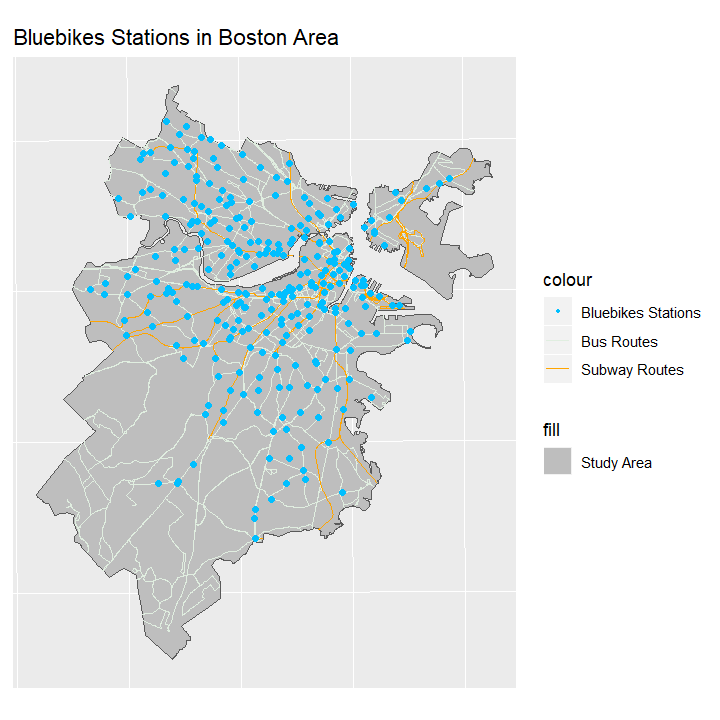
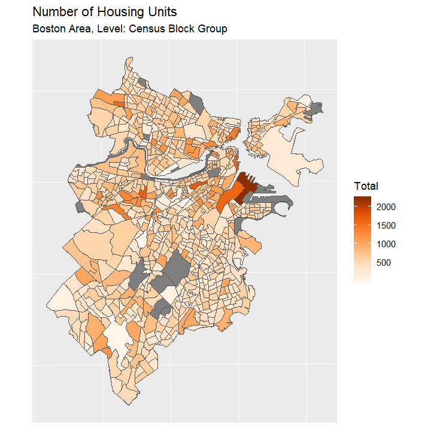
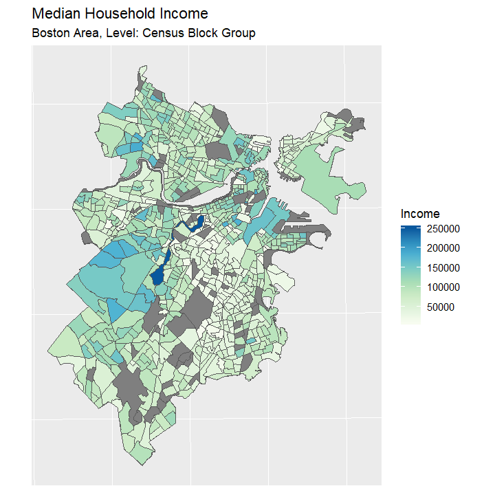
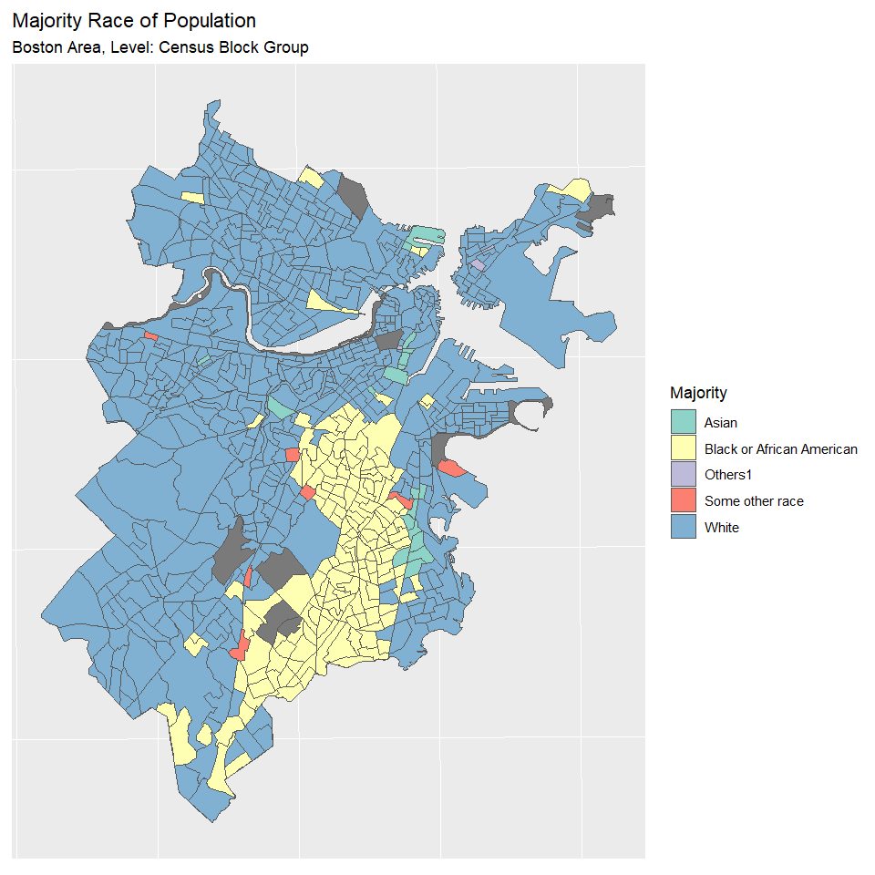
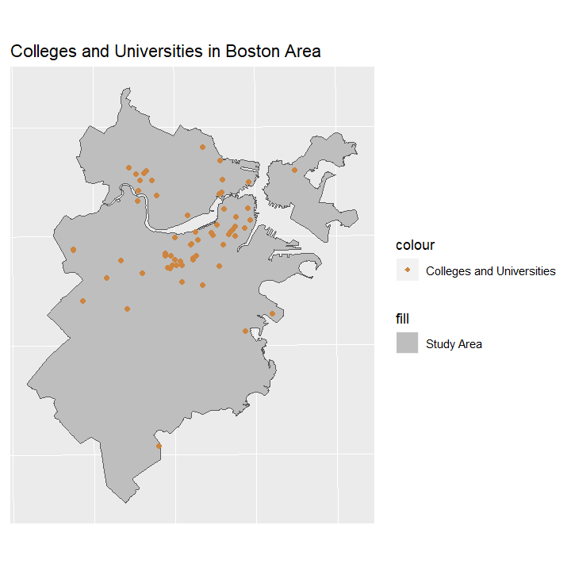

```{r setup, include=FALSE}
knitr::opts_chunk$set(
  collapse = TRUE,
  fig.align = "center",
  comment = "#>"
)
library(knitr)
options(width = 100)
```

## 1 Summary - PJin

Bike sharing system has received great attention in recent years. As a green way to get around, bike sharing system can relieve the traffic jam in big cities, reduce the emission of harmful gases from motor vehicles, and improve the first mile and last mile connection to other kinds of transits. In 2004, there are about 13 bike sharing systems around the world. But now, there are over 850 bike sharing systems globally.

Boston’s original bike sharing system, Hubway, was launched in 2011, and has changed the name to Bluebikess in 2018. Now, Bluebikess has more than 1,800 bikes and over 200 stations across Boston, Brookline, Cambridge and Somerville.

This project aims to explore the usage patterns of Boston’s bike sharing system, Bluebikess, thus help decision makers to manage the bike sharing system more properly, and promote the full use of Bluebikess.

The primary objectives includes:

1. Explore the usage of Bluebikess from 2015 to 2018. Find out how the number of use and trip durations change among different months. 

2. Use Linear Regression to figure out if there are any relationships between the number of use and the weather.

3. Use hot spot analysis to find out which stations are most popular, what kind of destinations are most popular, what kind of originals are most popular, and how they changed from 2015 to 2018.

4. Use Poisson mixture model to process stations trip count data, extract station clusters based on EM algorithm, and analyze the clusters with census data to find out latent factors contributing to the use of bike sharing system.

5. Summarize the usage profile of Bluebikess system and explore if there are any potential areas to promote new bike stations.


## 2 Approach and Method - MZhang
### 2.1 Data

Bluebikes publishes the trip data in csv format each quarter, providing the following information: trip duration, trip start and stop time and date, the id, name and GPS coordinates of start/end station, bike id, and user profile including id, type, gender and birth year. Analyses will be performed on the data from January 2015 to December 2018 in order to generate a comprehensive understanding of the sharing system. Figures below are histograms of Bluebikes trip data from 2015 to 2018.

```{r, waring=FALSE, message=FALSE, fig.width=6, fig.height=4, fig.align = "center"}
include_graphics("../vignettes/fig/bike2015.jpeg")
include_graphics("../vignettes/fig/bike2016.jpeg")
include_graphics("../vignettes/fig/bike2017.jpeg")
include_graphics("../vignettes/fig/bike2018.jpeg")
```


The code processing trip data is attached below.
```{r, eval = FALSE}
# Put trip data processing code here
```


Bluebikes also provides another csv file recording the GPS coordinates and the number of docks for each station. The number of trip for each station will be summarized from the trip dataset and joined to the spatial feature of bike station for hot spot and cluster analyses. The figure below presents Bluebikes stations and public transportation in Boston area. 

```{r, waring=FALSE, message=FALSE, fig.width=6, fig.height=4, fig.align = "center"}

```

Census data at block group scale is used to extract the demographic characteristics of neighboring community, thus drawing the profile of station clusters. Topics focused in this project are:

Population race

Median household income

Housing units

Means of transportation to work

The source of census data is the estimates of 2017 from 2013-2017 American Community Survey 5-Year Estimates. The following figures visualize the census data, in which grey polygons represent no data. 
```{r, waring=FALSE, message=FALSE, fig.width=6, fig.height=4, fig.align = "center"}


include_graphics("../vignettes/fig/poptotal.png")

include_graphics("../vignettes/fig/workmeans.png")
```

Shapefiles of Boston area, public transportation, colleges and universities are downloaded from MassGIS, which may contribute to the analysis on latent factors of bike usage. The figure below shows colleges and universities in Boston area.

```{r, waring=FALSE, message=FALSE, fig.width=6, fig.height=4, fig.align = "center"}

```


The code processing station and census data is attached below.

```{r, eval = FALSE}
library(BostonBikeSharingSystem)
library(dplyr)
library(tidyr)
library(tidyverse)
library(ggplot2)
library(rgdal)
library(sf)
library(gstat)

# Data path
dataPath <- "D:/R_final/BikeSharing_project/BostonBikeSharingSystem/Data/SocDem"
bikePath <- "D:/R_final/BikeSharing_project/BlueBike"
censusPath <- dir("../Data/SocDem/", pattern = ".csv", full.names = TRUE)

# Read in shapefiles and station loction data
sa <- dir(dataPath, pattern = "boston_group.shp", full.names = TRUE) %>%
  st_read() %>% select(COUNTYFP10, GEOID10)
subway <- dir(dataPath, pattern = "subway.shp", full.names = TRUE) %>%
  st_read()
bus <- dir(dataPath, pattern = "busroute.shp", full.names = TRUE) %>%
  st_read()
colleges <- dir(dataPath, pattern = "universities.shp", full.names = TRUE) %>%
  st_read()
bstation <- dir(bikePath, pattern = "Hubway_Stations_as_of_July_2017.csv", 
                full.names = TRUE) %>% read_csv() %>% 
  st_as_sf(., coords = c("Longitude", "Latitude"), crs = 4326) %>% 
  st_transform(x = ., crs = st_crs(sa))

# Read in census data and set the name for each dataset
names <- censusPath %>% basename() %>% strsplit(., "[.]") %>% unlist
census <- censusPath %>% 
   map(function(x) {
     read_csv(x) %>% rename(GEOID10 = Id2) 
   }) %>% set_names(names[!names %in% "csv"])

# Set value 0 to NA
is.na(census$housingunit) <- !census$housingunit
is.na(census$medhincome) <- !census$medhincome

# Add fields for visualization
popdata <- census$poprace %>% select(-GEOID10, -Total)
census$poprace <- census$poprace %>%
  mutate(majority = colnames(popdata)[max.col(popdata, ties.method = "first")])

census$worktransmeans <- census$worktransmeans %>% 
  mutate(pbike = Bicycle / Total)

# Change the class of GEOID10 in census dataset for join
census <- sapply(census, function(x) {
  x$GEOID10 <- x$GEOID10 %>% as.factor()
  return(x)
})

# Join census dataset to study area shapefile
censusshp <- sapply(census, function(x) {
  left_join(sa, x, by = "GEOID10")
})

# Visualize the data and save plots as png files
ggplot(sa %>% st_union()) +
  geom_sf(aes(fill = "Study Area")) +
  geom_sf(data = bus, aes(colour = "Bus Routes"), show.legend = "line") +
  geom_sf(data = subway, aes(color = "Subway Routes"), show.legend = "line") +
  geom_sf(data = bstation, aes(color = "Bluebikes Stations"), 
          show.legend = "point") +
  scale_fill_manual(values = ("Study Area" = "grey"),
                    guide = guide_legend(override.aes = 
                                           list(linetype = "blank",shape = NA))) +
  scale_color_manual(values = c("Bus Routes" = "honeydew2",
                                "Subway Routes" = "orange",
                                "Bluebikes Stations" = "deepskyblue"),
                     guide = guide_legend(override.aes = 
                                            list(linetype = 
                                                   c("blank", "solid", "solid"),
                                                 shape = c(20, NA, NA)))) +
    labs(title = "Bluebikes Stations in Boston Area") +
  theme_minimal()
ggsave("bikestations.png", path = "../vignettes/fig", dpi = 120,
       width = 6, height = 4, units = "in")

ggplot(sa %>% st_union()) +
  geom_sf(aes(fill = "Study Area")) +
  geom_sf(data = colleges, aes(colour = "Colleges and Universities"), 
          show.legend = "point") +
  scale_fill_manual(values = ("Study Area" = "grey"),
                    guide = guide_legend(override.aes = 
                                           list(linetype = "blank",shape = NA))) +
  scale_color_manual(values = c("Colleges and Universities" = "tan3"),
                     guide = guide_legend(override.aes = 
                                            list(linetype = "blank",
                                                 shape = 18))) +
    labs(title = "Colleges and Universities in Boston Area") +
  theme_minimal()
ggsave("colleges.png", path = "../vignettes/fig", dpi = 120,
       width = 6, height = 4, units = "in")

ggplot(censusshp$housingunit) + 
  geom_sf(aes(fill = Total)) +
  scale_fill_gradientn(colors = terrain.colors(7)) +
  labs(title = "Number of Housing Units",
       subtitle = "Boston Area, Level: Census Block Group")
ggsave("housingunits.png", path = "../vignettes/fig", dpi = 120,
       width = 6, height = 4, units = "in")

ggplot(censusshp$medhincome) + 
  geom_sf(aes(fill = Income)) +
  scale_fill_gradientn(colors = terrain.colors(10)) +
  labs(title = "Median Household Income",
       subtitle = "Boston Area, Level: Census Block Group")
ggsave("medianincome.png", path = "../vignettes/fig", dpi = 120,
       width = 6, height = 4, units = "in")

npop <- censusshp$poprace[censusshp$poprace$Total == 0, ]
ggplot(censusshp$poprace) + 
  geom_sf(aes(fill = Total)) +
  scale_fill_gradientn(colors = terrain.colors(10)) +
  geom_sf(data = npop, fill = "grey28") +
  labs(title = "Total Number of Population",
       subtitle = "Boston Area, Level: Census Block Group")
ggsave("poptotal.png", path = "../vignettes/fig", dpi = 120,
       width = 6, height = 4, units = "in")

rcols = c("lightblue", "khaki", "lightsalmon", "palegreen", "pink")
ggplot(censusshp$poprace) + 
  geom_sf(aes(fill = majority)) +
  scale_fill_manual(values = rcols) +
  geom_sf(data = npop, fill = "grey28") +
  labs(title = "Majority Race of Population",
       subtitle = "Boston Area, Level: Census Block Group")
ggsave("poprace.png", path = "../vignettes/fig", dpi = 120,
       width = 6, height = 4, units = "in")

nworkmeans <- censusshp$worktransmeans[censusshp$worktransmeans$Total == 0, ]
ggplot(censusshp$worktransmeans) + 
  geom_sf(aes(fill = pbike)) +
  scale_fill_gradientn(colors = terrain.colors(10)) +
  geom_sf(data = nworkmeans, fill = "grey28") +
  labs(title = "Percentage of Workers Riding the Bike to Work",
       subtitle = "Boston Area, Level: Census Block Group")
ggsave("workmeans.png", path = "../vignettes/fig", dpi = 120,
       width = 6, height = 4, units = "in")
```


### 2.2 Code

1. Bluebikess Trips Exploration

Clean up and summarize Bluebikess dataset for further analyses. Use packages tidyverse, dplyr and tidyr to analysis Bluebikess trips data from 2015 to 2018. Use packages ggplot2 to visualize the data. (Piaotian Jin and Mengyi Zhang)

2. Linear Regression

Use R's lm (linear model) function to fit a regression between the number of use and the weather. Find out is there any relationship between the number of use and the weather. (Piaotian Jin)

3. Hot Spot Analysis

Use package hotspots to perform hot analysis on Bluebikess trip data. Find out which stations are most popular, what kind of destinations are most popular, what kind of originals are most popular, and how they changed from 2015 to 2018. (Piaotian Jin)
   
Analyze the demographic characteristics in areas of hot/cold spot clusters. (Mengyi Zhang)

4. Poisson Clusters Analysis

Use package mixtool to conduct Poisson regressions and get the EM algorithm output. Identify station clusters and summarize their profile based on the feature of neighboring communities and demographics. (Mengyi Zhang)

## 3 Timelines - PJjin
April 15 - April 21: Bluebikess Trips Exploration (Piaotian Jin)

April 15 - April 21: Explore Poisson Clusters Analysis (Mengyi Zhang)

April 22 - April 25: Linear Regression (Piaotian Jin)

April 22 - April 28: Poisson Clusters Analysis (Mengyi Zhang)

April 26 - April 28: Hot Spot Analysis (Piaotian Jin)

April 26 - April 28: Combine the Hot Spot Analysis results with census data (Mengyi Zhang)

April 29 - May 5: Write Final Paper (Mengyi Zhang and Piaotian Jin)

## 4 Anticipated Outcomes - MZhang
1. Bluebikess Trips Exploration

Plots show how the number of use changes among different months from 2015 to 2018.

Plots show how the trip durations time changes among different months from 2015 to 2018.

2. Linear Regression

Linear Regression results of the number of use and the weather.

3. Hot Spot Analysis

Hot Spot Maps of stations from 2015 to 2018.

4. Poisson Cluster Analysis

Maps of station clusters and corresponding 
